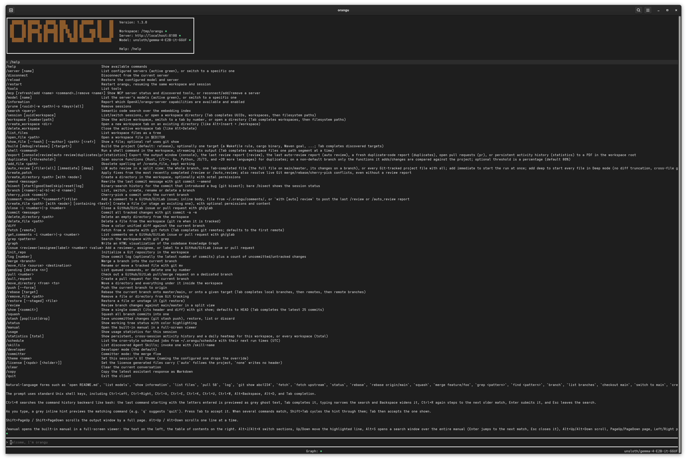
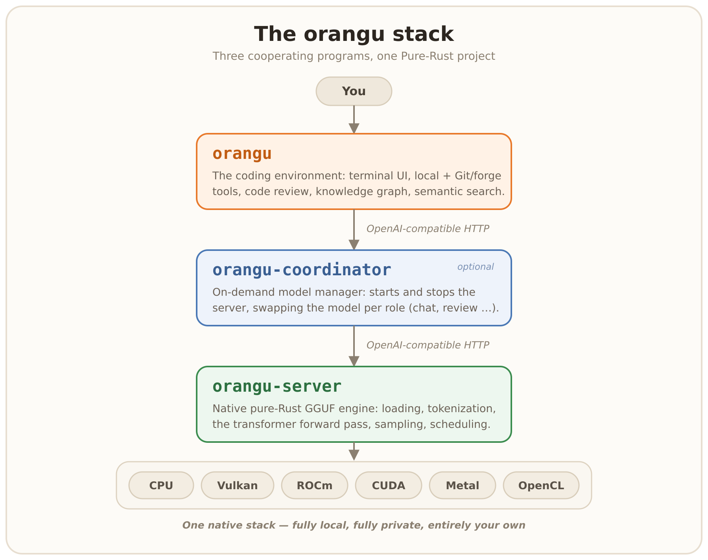

# orangu

**orangu** is a local, workspace-aware, tool-driven coding environment for your terminal.

**100% private and offline:** after downloading `orangu-server` and your models, no internet connection is required.

**A complete, self-contained AI coding stack:** It ships all three layers, written end-to-end in Rust:
1. **`orangu`** - Terminal coding environment, review workstation, and tool coordinator.
2. **`orangu-coordinator`** - On-demand model manager and server proxy.
3. **`orangu-server`** - Native, pure-Rust GGUF inference engine (**no llama.cpp, no ggml, no Python**).

Every layer communicates over OpenAI-compatible APIs.



## Key Strengths

- **Pure-Rust End-to-End Stack** - Single toolchain from CLI to transformer forward pass. Fast startup, small footprint, and zero Python/C++ runtime headaches.
- **100% Local & Private** - Zero telemetry. Your code, diffs, and prompts never leave your hardware.
- **Dual-Mode Code Review** - Built-in interactive two-pane diff review (`/review`) and automated LLM-driven rubric review with confidence scoring (`/auto_review`), turning findings into working code with `/create_patch`.
- **Model Context Protocol (MCP)** - Seamless integration with Streamable HTTP MCP servers for extensible tooling and system integration.
- **Text & Image Generation** - Native serving of chat, completion, embedding, and text-to-image models (`Qwen-Image` via `/v1/images/generations`).
- **Offline Knowledge Graph & Search** - Incremental Tree-sitter symbol graphs (`/graph`) and semantic code retrieval (`/search`) powered by local embeddings.
- **Built-in Build & Git Automation** - Full Git loop directly inside the prompt, plus `/build` detecting Cargo, CMake, Make, Go, Maven, and Python.

---

## 30-Second Quickstart

### 1. Install

**Linux / macOS** (via `curl` or `wget`):
```sh
curl -fsSL https://mnemosyne-systems.github.io/orangu/install.sh | sh
```

**Windows** (PowerShell):
```cmd
curl -fsSL https://mnemosyne-systems.github.io/orangu/install.cmd -o install.cmd && install.cmd
```

This installs the full stack (`orangu`, `orangu-coordinator`, `orangu-server`, `orangu-bench`, and `orangu-gguf`) into `~/.local/bin` (Linux/macOS) or `%USERPROFILE%\.local\bin` (Windows), and warns if the directory is not in your `PATH`.

**Custom install directory:** set `INSTALL_DIR` before running the script:
```sh
# Linux / macOS
curl -fsSL https://mnemosyne-systems.github.io/orangu/install.sh | INSTALL_DIR=/usr/local/bin sh
```
```cmd
:: Windows
set "INSTALL_DIR=C:\Tools" && install.cmd
```

### 2. Shell Completions

Run `orangu -s` to print completion scripts for bash, zsh, fish, or PowerShell (supported by all binaries: `orangu`, `orangu-server`, `orangu-coordinator`, `orangu-bench`, and `orangu-gguf`):

```sh
# bash
orangu -s >> ~/.bashrc && source ~/.bashrc

# zsh
orangu -s >> ~/.zshrc && source ~/.zshrc

# fish
orangu -s | source

# PowerShell (Windows)
orangu -s | Out-String | Invoke-Expression
```

### 3. Configure

Run the interactive setup wizard:
```sh
orangu --init
```
The wizard auto-detects any running model on your server, configures defaults, and writes `~/.orangu/orangu.conf`.

Alternatively, copy the sample configuration:
```sh
cp doc/etc/orangu.conf ./orangu.conf
```

### 4. Launch

```sh
# Start in the current repository
orangu

# Or point to a specific project directory
orangu -w /path/to/project
```

---

## The Stack at a Glance

Most local AI workflows cobble together disparate clients and engines. **orangu** unifies the entire workflow into a cohesive Rust architecture:



| Component | Role | Documentation |
| :--- | :--- | :--- |
| **`orangu`** | Terminal UI, Git & workspace tools, `/review`, knowledge graph, context compression | [Terminal Reference](doc/manual/en/40-terminal.md) · [Core Tools](doc/manual/en/41-core_tools.md) |
| **`orangu-coordinator`** | On-demand proxy that boots/stops `orangu-server` and swaps models to fit single-GPU VRAM | [Coordinator Guide](doc/COORDINATOR.md) |
| **`orangu-server`** | Native GGUF inference engine (CPU, Vulkan, Metal, CUDA, ROCm), OpenAI API, web console | [Server Guide](doc/SERVER.md) |
| **`orangu-bench`** | Throughput & latency benchmarking harness across OpenAI-compatible servers | [Benchmarking Manual](doc/manual/en/79-bench.md) |
| **`orangu-gguf`** | Model pretraining, corpus packing, and GGUF quantization tool (`Q6_K` down to `IQ1`) | [Model Building Guide](doc/BUILD_MODEL.md) |

---

## Core Features

### In-Terminal Code Review Workflows

orangu turns your terminal into a complete code-review workstation against your merge base:

- **`/review` (Interactive Review)**: Full-screen two-pane reviewer (diff vs. checklist). Mark files approved/rejected, add comments categorized by Code, Security, Memory, or Performance, and query the LLM inline on any diff line.
- **`/auto_review` (LLM-Driven Review)**: Automated pass applying a strict **Confidence Scoring Rubric (0-100)** to eliminate hallucinations and nitpicks. Generates category breakdowns and approve/reject verdicts. Supports single files (`/auto_review <file>`), deep cross-file knowledge-graph context (`deep`), or immediate runs (`immediate`).
- **`/create_patch` (Turn Findings into Code)**: Feeds verified review findings back to the model to generate and apply working patches in your tree without auto-committing. Also resolves Git merge/rebase conflicts.

*Read more in the [Review Workflows Manual](doc/manual/en/45-workflows.md) and [Core Tools Reference](doc/manual/en/41-core_tools.md).*

### Native GGUF Inference Engine (`orangu-server`)

A high-performance inference engine built entirely in Rust:
- **Broad Architecture Coverage**: Runs 17 servable model families, including Llama, Mistral, Qwen (dense & MoE), Gemma (including Gemma 4 MoE), DeepSeek-V4, GLM, Kimi-K3, Phi, Nemotron-H, and text-to-image diffusion models (`Qwen-Image`).
- **Hardware Acceleration**: CPU, **Vulkan** (AMD, NVIDIA, Intel), **Metal** (macOS Apple Silicon native), **CUDA**, and **ROCm**.
- **Quantization Support**: Native dequantization for `F32`/`F16`/`BF16`, `Q4_0`-`Q8_0`, K-quants (`Q2_K`-`Q6_K`), I-quants (`IQ4_XS` to sub-1.5-bit `IQ1_XXXS`), and Prism's ternary `PQ2_0`/`PTQ1_0`.
- **Text & Image Generation**: Serves `/v1/chat/completions`, `/v1/embeddings`, and `/v1/images/generations` (with the `--image` deployment role).
- **Single-File Bundles**: Package the server and a model into a standalone binary with `orangu-server bundle <model>`.
- **Built-in Web Console**: Optional browser chat interface with live tokens/sec, syntax highlighting, and model switching.

*See [doc/SERVER.md](doc/SERVER.md), [doc/manual/en/46-server.md](doc/manual/en/46-server.md), and [doc/manual/en/48-image.md](doc/manual/en/48-image.md) for architecture internals, image generation, and backends.*

### Extensibility: MCP, Skills & Agent Memory

- **Model Context Protocol (MCP)**: Native client for Streamable HTTP MCP servers, dynamically exposing remote tools to the model with configurable user approval policies (`prompt`, `writes`, `auto`, `deny`).
- **Agent Skills (`SKILL.md`)**: Automatically discovers and registers modular domain skills from `~/.orangu/skills/`, `~/.agents/skills/`, and workspace folders.
- **Cross-Session Memory (`AGENTS.md`)**: Persistent project rules and instructions automatically loaded from `AGENTS.md` in the workspace or home directory.

*See the [Skills Manual](doc/manual/en/32-skills.md) and [Tools Reference](doc/manual/en/30-tools.md).*

### Workspace & Git-Centric Tooling

- **Prompt-Driven Git Loop**: Commit, amend, rebase, squash, stash, branch, cherry-pick, and bisect without leaving the prompt.
- **Forge Integration**: Interact with GitHub and GitLab issues, PRs, and review comments directly (`/pull_request`, `/comment`, `/issue`).
- **Unified Build Engine (`/build`)**: Auto-detects toolchains (Cargo, CMake, Make, Meson, Maven, Go, Python) and runs format, lint, build, and test pipelines.
- **Codebase Knowledge Graph (`/graph`)**: Tree-sitter AST dependency graph to map function calls, classes, and architectural hierarchy; exports interactive HTML diagrams.
- **Semantic Search (`/search`)**: Hybrid vector embeddings + call-graph ranking to find code by meaning rather than exact string matches.
- **Context Compression Engine**: AST-aware file downsampling, smart diff compaction, and token window preservation ([Compression Manual](doc/manual/en/75-compression.md)).

---

## orangu vs. Cloud Coding Assistants

| Feature / Aspect | **orangu** | **Typical Cloud Coding Assistant** |
| :--- | :--- | :--- |
| **Where your code goes** | Stays on your machine - zero telemetry | Sent to third-party cloud servers |
| **Offline operation** | First-class; fully functional without Internet | Requires continuous Internet access |
| **Model choice** | Any local GGUF model via pure-Rust `orangu-server` | Vendor-restricted models & API keys |
| **Running cost** | Free forever on your own hardware | Monthly subscriptions or per-token fees |
| **Footprint** | Single fast Rust binary, instant startup | Heavy editor plugins or electron wrappers |
| **Code review** | In-terminal interactive (`/review`) & LLM auto-review | Often outsourced to browser PR views |
| **Git integration** | Full Git & forge cycle directly in the prompt | Varies; often limited or external |
| **Security & Privacy** | Ideal for air-gapped, regulated, or sensitive repos | Subject to cloud provider data policies |

---

## Common Commands & Shortcuts

```text
/help              List all commands and shortcuts
/review            Start interactive 2-pane code review
/auto_review       Run automated LLM review with confidence scoring
/create_patch      Apply review fixes or resolve merge conflicts
/build             Run auto-detected build/test pipeline
/graph             Generate interactive codebase architecture graph
/search <query>    Perform semantic code search
/mcp               Show connected MCP servers and discovered tools
/skills            List available agent skills
/status            Display Git status and workspace context
/usage             View token consumption and session timings
/theme <name>      Switch themes (e.g. tokyonight, modern_dark, classic)
```

Useful CLI switches:
- `orangu -p "prompt"`: Run single prompt or slash command headless and exit.
- `orangu -w <path>`: Launch with a specific workspace root.
- `orangu -r [uuid]`: Resume a previous session (or launch interactive picker if omitted).
- `orangu -a`: Reopen all workspace tabs from your previous session.
- `orangu -s`: Output shell completion script for Bash, Zsh, Fish, or PowerShell.

---

## Building from Source

### Dependencies

- **Fedora / RHEL:** `sudo dnf install -y git rust cargo`
- **Debian / Ubuntu:** `sudo apt-get install -y git curl && curl --proto '=https' --tlsv1.2 -sSf https://sh.rustup.rs | sh`
- **macOS:** `brew install rust`

### Compilation

```sh
git clone https://github.com/mnemosyne-systems/orangu.git
cd orangu
cargo build --release
sudo install -Dm755 target/release/orangu /usr/local/bin/orangu
```

---

## Documentation & Manuals

orangu includes an **embedded offline manual** accessible anytime directly from the terminal via `/manual` (with full-text search using `Alt+S`).

Additional documentation and guides:
- [Getting Started Guide](doc/GETTING_STARTED.md)
- [Configuration Reference](doc/CONFIGURATION.md) · [Configuration Manual](doc/manual/en/20-configuration.md)
- [Inference Server Guide](doc/SERVER.md) · [Server Manual](doc/manual/en/46-server.md) · [Server Internals](doc/manual/en/78-server.md)
- [Image Generation Manual](doc/manual/en/48-image.md)
- [Coordinator Guide](doc/COORDINATOR.md) · [Coordinator Manual](doc/manual/en/44-coordinator.md) · [Coordinator Internals](doc/manual/en/76-coordinator.md)
- [Model Building & Quantization](doc/BUILD_MODEL.md) · [GGUF Manual](doc/manual/en/47-gguf.md) · [Corpus Manifest](contrib/orangu-model/README.md)
- [Core Tools Reference](doc/manual/en/41-core_tools.md) · [Git Tools](doc/manual/en/42-git_tools.md) · [Workspaces](doc/manual/en/31-workspaces.md)
- [Context Compression Details](doc/manual/en/75-compression.md)
- [HTTP API Reference](doc/manual/en/80-http.md) · [Engine Contributor's Map](doc/ENGINE.md)
- [Developer Information](doc/manual/en/70-dev.md) · [Benchmarking Manual](doc/manual/en/79-bench.md)

---

## Tested Platforms

CI verifies builds and runs tests on every push across:

| Operating System | CI Runner |
| :--- | :--- |
| Linux | `ubuntu-latest` |
| macOS | `macos-latest` (Apple Silicon) |
| Windows | `windows-latest` |

Day-to-day development happens on [Fedora](https://getfedora.org/).

---

## Community & Contributing

- **Discussions:** [GitHub Discussions](https://github.com/mnemosyne-systems/orangu/discussions)
- **Issues & Requests:** [GitHub Issues](https://github.com/mnemosyne-systems/orangu/issues)
- **Pull Requests:** [GitHub Pull Requests](https://github.com/mnemosyne-systems/orangu/pulls)
- Please review our [Code of Conduct](CODE_OF_CONDUCT.md) before contributing.

## Sponsors

- [mnemosyne systems](https://www.mnemosyne-systems.ai/)

## License

[GNU General Public License v3.0](https://www.gnu.org/licenses/gpl-3.0.en.html)
