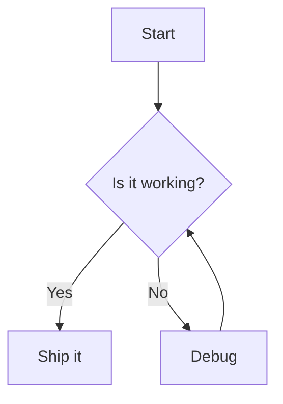
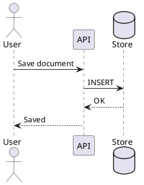

\newpage

# Inference server

`orangu-server` loads a GGUF model and serves an OpenAI-compatible HTTP
API — both the OpenAI-compatible endpoints (`/v1/chat/completions`,
`/v1/completions`, `/v1/embeddings`, `/v1/models`) and its own
native ones (`/health`, `/props`, `/slots`, `/metrics`, `/completion`,
`/tokenize`, `/detokenize`, `/embedding`, `/apply-template`).

`orangu-server` *is* the inference engine: GGUF loading, tokenization, the
transformer forward pass, sampling, and request scheduling are implemented
directly in Rust, with no dependency on any C or C++ inference library.
`orangu-coordinator` (see the Coordinator chapter) sits in front of it,
starting and stopping an `orangu-server` process on demand for machines
that only have the resources to keep one model resident at a time — this
chapter covers `orangu-server` itself.

It's also the machine's GGUF inventory tool — the `system`/`suggest`/
`list`/`show`/`download`/`delete`/`refresh` subcommands (below) answer the
questions that matter when *getting*, *choosing*, and *cleaning up* a model,
before or after serving. Those seven read (or write) GGUF files directly off
disk and query the local machine, no model loaded and no HTTP listener bound;
`download` and `refresh` talk to the Hugging Face Hub to fetch a model, and
`list` talks to it too — before printing its table, to check whether a newer commit
exists for each Hugging Face-backed model already on disk (see **`list` and
`show`** below). If the Hub is unreachable, `list` still prints the table;
it just skips the check silently rather than failing the command.

One further subcommand is neither serving nor inventory: `bundle` writes a
single executable carrying both this server and a model, which then runs with
no models directory and no configuration file at all. See **Bundling** below.

## Quick start

```sh
orangu-server unsloth/gemma-4-E2B-it-GGUF
```

The model argument is resolved the same way `show`/`download` resolve one:
an existing local `.gguf` path, an `NR`/`MODEL` label already under the
configured `models` directory (see `orangu-server list`), or a
`<user>/<model>[:quant]` Hugging Face repo — fetched into `models` first if
it isn't already cached there. No separate download step is needed.

Leave it off entirely and `orangu-server` lists every `.gguf` model under
the configured `models` directory and prompts for one by `NR`, then —
unless `--all`/`--code`/`--review`/`--explorer`/`--embedding` was passed —
prompts for a role too (see below), TAB-completing over the five valid
names (dropdown-style: an empty `TAB` press lists all five) and defaulting
to `all` on an empty entry:

```sh
orangu-server
```

```
NR  MODEL                            QUANT   SIZE        SUPPORTED
 1  Qwen/Qwen2.5-0.5B-Instruct-GGUF  Q4_K_M  468.64 MiB  Yes (qwen2)
 2  unsloth/gemma-4-E2B-it-GGUF      Q4_K_M  2.89 GiB    Yes (gemma4)

Select a model (NR): 2
role [all]: 
```

When the directory holds exactly one model there is nothing to choose
between, so the `NR` prompt is skipped — the table is still printed (it
names the model and whether this build supports it), and the run goes
straight on to the role prompt:

```
NR  MODEL                            QUANT   SIZE        SUPPORTED
 1  Qwen/Qwen2.5-0.5B-Instruct-GGUF  Q4_K_M  468.64 MiB  Yes (qwen2)

model: Qwen/Qwen2.5-0.5B-Instruct-GGUF:Q4_K_M
role [all]: 
```

On startup, `orangu-server` prints the same OS/CPU/GPU report `system`
does, followed by the model/UI/API/workspace summary:

```
OS
  Name             : Fedora Linux
  ...

CPU
  Model            : AMD Ryzen 7 4800H with Radeon Graphics
  ...

GPU
  [0] AMD Navi 14 [Radeon RX 5500/5500M / Pro 5300/5300M/5500M]
      ...

Model      unsloth/gemma-4-E2B-it-GGUF:Q4_K_M (llama arch, CPU/AVX2, 26 layers, 8192 ctx)
UI         disabled
API        http://0.0.0.0:8100
Workspace  /home/user/src/orangu
```

The model line names the model as `MODEL:QUANT` — the quantization the
resolved file is actually stored at, the same value `list`'s `QUANT` column
shows, appended unless the model was named with a `:tag` of its own already.
Its second field names the backend the forward pass actually
ran on: `CPU`/`CPU/AVX2`, or `Vulkan/<adapter name>`, `Metal/<device name>`,
`DX12/<adapter name>`, `CUDA/<device name>`,
`OpenCL/<device name>`, `ROCm/<device name>` when the matching GPU backend
was used (see **GPU backend** below). Above the banner, a GPU backend also
lists every device it saw and marks the one it took — see **Choosing a
device**. The workspace line is the directory
tree this server operates in (see **Workspace** below).

Every completed request logs a throughput line, orangu-server-style:

```
orangu-server: [slot 0] prompt 42 tokens in 0.18s (233.33 tok/s), generated 128 tokens in 4.31s (29.70 tok/s)
```

## GGUF inventory

Seven subcommands cover getting, choosing, keeping current, and cleaning up
a model, all sharing the same `orangu-server.conf` and its `models`
directory (see **Configuration** below).

Each of them names itself in the **terminal title** while it runs —
`orangu-server download`, `orangu-server list`, `orangu-server prune`, and
so on (`orangu-server init` for `-i`) — so a backgrounded or unfocused
terminal still says which mode that process is in. Serving keeps the plain
`orangu-server`, set as soon as the model starts resolving rather than only
once it's loaded. The title is left alone entirely when output isn't going
to a terminal (`orangu-server list > models.txt`, or under `--daemon`), and
is cleared again when the command finishes.

**`download`** fetches a model from Hugging Face into the configured
`models` directory, laid out **exactly** the way the standard GGUF
`-hf`/`--hf-repo` downloads into —
`models--<user>--<model>/{blobs,refs,snapshots}`, content-addressed blobs
with a relative symlink per file — so `list`/`show` already read what this
writes, and other GGUF tools recognize it as already downloaded rather
than fetching it again:

```sh
orangu-server download unsloth/Qwen3-Coder-30B-A3B-Instruct-GGUF:Q4_K_M
orangu-server download ggml-org/embeddinggemma-300M-GGUF   # no :quant -> prefers Q4_K_M, then Q8_0
```

```
Downloading Qwen3-Coder-30B-A3B-Instruct-Q4_K_M.gguf: 47% [1/1]
Total 47%: 0/1 files (8.60 GiB of 18.30 GiB), 1 active, 0 queued, ETA 12m
```

If the repository also ships a multimodal projector (`mmproj-*.gguf`,
needed for vision/audio input), it's fetched alongside the model too — the
same best-matching one orangu-server's own `-hf` would auto-fetch on first
launch anyway, so `LLAMA_CACHE=<models>` already has it ready offline
instead of needing a live fetch the first time a vision-capable model is
launched. A multi-part model's every shard (and a bundled `mmproj`)
downloads concurrently rather than one at a time; an interrupted download
resumes from where it left off next time. Set `HF_TOKEN` in the environment
for a private or gated repository.

A sharded model shows **one line per file**, all of them from the start and
all of them in one block, closed by a `Total` line for the run as a whole.
A file is `Queued` until a thread picks it up, `Downloading` while it
streams, and `Downloaded` once it's on disk — including a file that was
already there when the command started, which is simply downloaded as far as
anything else is concerned. Those three are the whole vocabulary: an attempt
that failed and is waiting to retry is still `Downloading`, at the
percentage it had already reached, with the retry noted on that same line —
a retry resumes from the bytes on disk rather than starting the file over.
Every line is rewritten in place as that file's own state changes:

```
Downloaded UD-Q8_K_XL/Kimi-K3-UD-Q8_K_XL-00001-of-00034.gguf: 100% [1/35]
Downloading UD-Q8_K_XL/Kimi-K3-UD-Q8_K_XL-00002-of-00034.gguf: 63% [2/35]
Downloading UD-Q8_K_XL/Kimi-K3-UD-Q8_K_XL-00003-of-00034.gguf: 12% (retry 1/5 in 30s) [3/35]
Queued UD-Q8_K_XL/Kimi-K3-UD-Q8_K_XL-00004-of-00034.gguf [4/35]
...
Downloaded mmproj-BF16.gguf: 100% [35/35]
Total 12%: 2/35 files (7.12 GiB of 58.30 GiB), 15 active, 18 queued, ETA 2h:47m
```

`Total` is **bytes**, not an average of the per-file percentages: how much
of the model is on disk against what all of it really weighs. So a 5 GiB
shard half fetched counts for more than a finished 200 MiB one, and nothing
is rounded away.

Both of those numbers are known **before the first byte is fetched** — the
sizes from the repository listing (an LFS file's own object size, never
anything measured on disk), what's already there from any `.part` an
interrupted earlier run left behind. So the `Total` line is accurate from
the moment it appears rather than climbing as threads free up, and a file a
previous run got partway through says so while it waits: `Queued
…-00002-of-00034.gguf: 23% [2/35]`.

The **ETA** is that difference — the real total minus what's downloaded, so
every outstanding byte including the queued files' — divided by the rate
**this** run has actually pulled off the network. Bytes that were already on
disk are progress but not throughput: counting them as speed would have a
resumed terabyte-sized download claim to be minutes from finishing. It reads
`2h:47m` past the hour and `47m` under it, and appears once there are a
few seconds of real transfer to extrapolate from — before that, and once
everything is fetched, there's no ETA on the line at all.

Before a single byte is fetched, the free space on the filesystem holding
the `models` directory is checked against what this run still has to write
— the model's real total less whatever is already on disk. A download that
can't possibly fit is refused there and then, rather than filling the disk
somewhere in the middle of a multi-hour fetch:

```
error: not enough free space in /mnt/ai/models/models--unsloth--Kimi-K3-GGUF/blobs:
       1.31 TiB needed, 103.08 GiB free (short by 1.21 TiB)
```

The free space counted is what's available to *your* user, not counting the
root-only reserve. There's no safety margin beyond that: the check catches
the download that cannot fit, not the one that fits with little to spare,
and it can't account for anything else writing to the same filesystem while
the download runs. On a platform that can't report free space (Windows), the
check is skipped rather than guessed at.

Redrawing in place needs the whole block on screen at once, so a model with
more files than the terminal has rows drops the per-file lines and leaves
the `Total` line standing alone — it accounts for all of them anyway.
Making the window taller (or having fewer files than rows) brings the
per-file lines back. When output isn't a terminal at all (`orangu-server
download ... | tee log`), there's no cursor movement or redraws: a plain
line per file as it finishes, plus one whenever a download stalls into a
retry, so a slow run still says why.

**`system`** detects the machine's operating system, CPU and GPU(s) — the
same report printed at the top of every attached `orangu-server` startup
(see **Quick start** above):

```sh
orangu-server system
```

```
OS
  Name             : Fedora Linux
  Version          : 44
  Kernel           : 7.1.3-200.fc44.x86_64
  Distribution     : fedora
  Machine          : Micro-Star International Co., Ltd. Bravo 15 A4DDR
  Hostname         : orangu
  Uptime           : 20d 07h
  Load average     : 4.80, 4.09, 3.25
  Swap total       : 16.00 GiB
  Swap used        : 13.23 GiB
  Huge pages       : madvise
  Page size        : 4.00 KiB
  Open files       : 1048576 (max 1048576)
  Models           : /home/orangu/models
  Models used      : 42.31 GiB
  Models free      : 118.92 GiB
  Built for        : x86_64-linux-gnu

CPU
  Model            : AMD Ryzen 7 4800H with Radeon Graphics
  Vendor           : AuthenticAMD
  Architecture     : x86_64
  Physical cores   : 8
  Logical cores    : 16
  Frequency        : 4.29 GHz
  Memory total     : 62.19 GiB
  Memory available : 36.19 GiB
  SSE4.2           : Yes
  AVX2             : Yes
  AVX512           : No

GPU
  [0] AMD Navi 14 [Radeon RX 5500/5500M / Pro 5300/5300M/5500M]
      Memory type  : Dedicated
      VRAM total   : 3.98 GiB
      VRAM used    : 3.71 GiB
      Driver       : amdgpu
```

The `OS` section leads: which OS this is frames how everything under it
should be read. It reports the distribution/OS name and version, the
kernel, the machine's own vendor and product, hostname, uptime, load
average, swap, the transparent-hugepage policy, page size, the open-file
limit (`RLIMIT_NOFILE`, soft and hard), and the target this binary was
built for — which isn't always the machine it runs on, an
`x86_64` build on an `aarch64` Mac being under Rosetta.

The three `Models` lines are the disk side of the same picture: the
configured `[orangu-server].models` directory, the space its contents take
(everything under it, with a blob shared by several snapshot revisions
counted once — not just the `.gguf` files `list` shows), and the free space
left on the filesystem holding it, which is what the next `download` has to
fit into. They need a config file to know which directory to measure, so on
a machine that has none — `system` deliberately runs without one — those
three lines are left out and the rest of the report is unchanged.

Every field is best-effort and every platform answers a different subset;
whatever the running platform can't answer simply gets no line rather than
a line saying `unknown`. Linux answers all of them, macOS all but the
hugepage line (a Linux concept), and Windows the portable ones — name,
edition, build, hostname, uptime, swap. Nothing here shells out: the
portable fields come from [`sysinfo`](https://docs.rs/sysinfo), the POSIX
ones from `libc`, and the Linux-specific ones from plain `procfs`/`sysfs`
file reads.

GPU detection has no single cross-platform API, so it layers several
best-effort sources: `nvidia-smi` for NVIDIA (Linux and Windows), Linux's
`/sys/class/drm` for everything else on Linux (AMD, Intel, and any other
PCI display device), and native OS tools (`system_profiler`/PowerShell's
`Win32_VideoController`) on macOS and Windows. A machine where none of
them finds anything gets no `GPU` section at all — the CPU inventory is the
whole report — rather than a heading over a "none detected" line. `Memory type` tells apart a
genuine dedicated card from an integrated GPU/APU sharing the CPU's system
RAM — a `Shared` GPU's `VRAM total` is always reported as the machine's
total system RAM regardless of what its own platform query said, since
that's the real ceiling on how much it can actually draw on.

**`suggest`** estimates a GGUF model *size* (parameter count, not a
specific model yet) likely to run comfortably on this machine, printed as a
table — one row per context length, one column per quantization — sized
against two budgets: dedicated GPU VRAM alone (its table is skipped
entirely on a machine with no dedicated GPU at all, rather than printing a
useless 0 B budget of nothing but `-`), and the machine's total — the
largest single memory pool on it, GPU or system RAM:

```sh
orangu-server suggest
```

```
Suggested model size (Dedicated)
  Estimated budget : 3.98 GiB

  Context  Suggestion (Q2_K)  Suggestion (Q4_K_M)  Suggestion (Q8_0)
  -------  -----------------  -------------------  -----------------
  1K       ~9B parameters     ~4B parameters       ~3B parameters
  ...
```

Both budgets are a **largest single pool**, never a sum of pools: a model
is loaded onto one device and runs on one backend, with no tensor split
across two GPUs and no partial-offload split of layers between a GPU and
the CPU, so no run can draw on a discrete card's VRAM *and* system RAM (or
on two cards) at once. Dedicated VRAM is one of the
candidates for it, which makes the `Dedicated` table above the *fast*
subset of this one rather than a separate machine.

Each budget names the pool it came from — `3.98 GiB (Navi 14 [Radeon RX
5500M])`, or `62.19 GiB (system RAM)`. On a machine with several GPUs a
bare byte count is a number whose most plausible misreading (the iGPU,
which reports the whole of system RAM as its memory) is off by an order of
magnitude.

The memory-estimation formula mirrors [Sam McLeod's GGUF VRAM
Estimator](https://smcleod.net/vram-estimator/): model weight bytes scale
as parameters × bits-per-weight ÷ 8, KV cache bytes scale with context
length × layers × hidden size, plus a small fixed runtime overhead. Both
budgets are sized against total memory rather than what happens to be free
right now, so treat them as hardware ceilings, not promises.

**`list`** recursively scans the configured `models` directory for `.gguf`
files and prints one row per model (a multi-shard model collapses into a
single row, with `SIZE` summed across shards):

```sh
orangu-server list
```

```
NR  MODEL                                        QUANT   SIZE        SUPPORTED
 1  unsloth/Qwen3-Coder-30B-A3B-Instruct-GGUF    Q4_K_M  17.28 GiB   Yes (qwen3)
 2  unsloth/Qwen3-Coder-480B-A35B-Instruct-GGUF  Q4_K_M  270.14 GiB  Yes (qwen3)
 3  ggml-org/gemma-4-12B-it-GGUF                 Q4_K_M  7.14 GiB    Yes (gemma4)
 4  unsloth/GLM-5.2-GGUF                         Q4_K_M  433.83 GiB  No (glm-dsa)
```

`NR` numbers models in the printed order, starting from 1 — a shorthand for
`show` so you don't have to retype a long `MODEL` string. When a file was
downloaded by `-hf`/`--hf-repo`, `MODEL` is the repo id to hand back to
`-hf`: `<user>/<model>`. The `:quant` tag is left off — `QUANT` shows it in
the next column — so two quantizations of one repo print the same `MODEL` and
are told apart by their `QUANT` cells. Both spellings resolve against what's
on disk, so `unsloth/gemma-4-E2B-it-GGUF` and
`unsloth/gemma-4-E2B-it-GGUF:Q4_K_M` name the same local model; use the
tagged form (or the row's `NR`) to pick one particular quantization of a repo
that has several, and to ask for one that isn't downloaded yet. A
multimodal projector ("mmproj") sidecar file doesn't count as its own
model — it's meant to be loaded *alongside* a base model, not to stand in as
one.

`SUPPORTED` says whether this build can actually load the model's
architecture — `Yes (<arch>)` or `No (<arch>)`, where `<arch>` is the GGUF
`general.architecture` (e.g. `qwen3`, `gemma4`, `glm-dsa`). A `No` row (like
the `glm-dsa` one above) is printed greyed rather than hidden: you can still
select it, but loading it will fail with a clear "not yet supported" error,
so the column tells you that up front. The greying is only emitted to a
terminal — piped or redirected output stays plain text, so the shell
completion scripts that read `list` by column keep working.

For every row that names a Hugging Face repo, `list` also checks that repo's
current `main` commit against the one the local copy was downloaded at, in
parallel across every distinct repo on the list. A row that's behind gets a
trailing `(Refresh)` marker after its last column:

```
NR  MODEL                                      QUANT   SIZE       SUPPORTED
 1  unsloth/Qwen3-Coder-30B-A3B-Instruct-GGUF  Q4_K_M  17.28 GiB  Yes (qwen3) (Refresh)
 2  ggml-org/gemma-4-12B-it-GGUF               Q4_K_M  7.14 GiB   Yes (gemma4)
```

`refresh` (below) is the command that acts on it. The check needs the Hub to
be reachable: when it isn't, `list` still prints its table and simply skips
the check, silently, rather than failing or leaving a stale marker. A model
outside the Hugging Face hub cache layout has no repo to check against and
never gets a marker.

**`show`** prints a GGUF file's full metadata — every key/value pair in the
file, not just the well-known keys. Omit the argument entirely to pick one
interactively (`list`'s own table, then an `NR` prompt):

```sh
orangu-server show 3                                     # NR from `list`
orangu-server show unsloth/Qwen3-Coder-Next-GGUF          # MODEL from `list`
orangu-server show Qwen3-Coder-30B-A3B-Instruct.gguf      # bare name under `models`
orangu-server show ./relative/or/absolute/path.gguf
orangu-server show 3 --tensors   # also list every tensor's shape/type/offset
orangu-server show 3 --full      # print full arrays instead of a preview
orangu-server show               # no argument: list, then pick an NR interactively
```

Array-valued metadata (e.g. `tokenizer.ggml.tokens`, which routinely holds
well over 100,000 entries) is truncated to a short preview by default —
`--full` disables that. Tensor data itself is never read, only the header,
metadata, and tensor-info table, so `list`/`show` stay fast even against
multi-gigabyte model files.

**`delete`** removes a model from disk, resolving its argument the same
way `show` does (or, omitted, the same interactive `list` + `NR` prompt
bare `orangu-server` uses to pick a model to serve — here picking one to
remove instead), and always against every shard the model is made of, so a
multi-shard model is deleted atomically rather than leaving orphans behind:

```sh
orangu-server delete 3                                     # NR from `list`
orangu-server delete unsloth/Qwen3-Coder-Next-GGUF          # MODEL from `list`
orangu-server delete                                        # no argument: interactive
```

```
Delete 'unsloth/Qwen3-Coder-Next-GGUF' (Q4_K_M, 4 files, 17.28 GiB) from /home/you/models? [y/N]: y
Deleted 'unsloth/Qwen3-Coder-Next-GGUF' (Q4_K_M, 4 files, 17.28 GiB)
```

Asks for confirmation first (`[y/N]`, defaulting to **No**) unless
`-y`/`--yes` is given. When a file lives under a Hugging Face hub cache,
its target blob is reclaimed too — but only when no other snapshot left in
that repo still references it — and any now-empty `snapshots/<rev>/` or
`models--<user>--<model>/` directory left behind is cleaned up, never
anything above the configured `models` directory itself.

**`refresh`** downloads a model again at its repo's newer commit — what a
`(Refresh)` marker in `list` asks for. It is `delete` plus `download` of the
same `<user>/<model>:<quant>` spec, in one step:

```sh
orangu-server refresh 3                                        # NR from `list`
orangu-server refresh unsloth/Qwen3-Coder-Next-GGUF             # MODEL from `list`
orangu-server refresh bartowski/Llama-3.2-1B-Instruct-GGUF:Q6_K # one quantization of several on disk
orangu-server refresh                                           # no argument: interactive
```

```
Refresh 'unsloth/Qwen3-Coder-Next-GGUF:Q4_K_M' (4 files, 17.28 GiB)? The local copy is deleted first, then downloaded again. [y/N]: y
Deleted 'unsloth/Qwen3-Coder-Next-GGUF' (4 files, 17.28 GiB)
Downloaded to /home/you/models/models--unsloth--Qwen3-Coder-Next-GGUF/snapshots/<newcommit>/...
```

The local copy really does go first. A changed repo means a full second copy
on disk, not a cheap blob-sharing snapshot, so deleting first means a 17 GiB
model needs 17 GiB free to refresh rather than 34 — at the cost that an
interrupted download leaves the model missing rather than stale. Re-running
`refresh` (or `download`, which resumes from the `.part` file left behind)
is what recovers from that.

The argument resolves the way `delete`'s does, with one difference: a `MODEL`
name that matches more than one row is an error rather than a first-match.
Since `refresh` deletes what it then downloads, silently picking a row would
refresh the wrong quantization *and* leave the one you meant untouched:

```
$ orangu-server refresh bartowski/Llama-3.2-1B-Instruct-GGUF
error: 'bartowski/Llama-3.2-1B-Instruct-GGUF' names 2 models on disk (Q4_K_M, Q6_K); name the quantization too — 'bartowski/Llama-3.2-1B-Instruct-GGUF:Q4_K_M' — or use an NR from 'orangu-server list'
```

With no argument, `refresh` prints `list`'s table with every row that is
*already* current greyed out — the inverse of what `list` greys — so the only
`NR`s standing out are the ones worth refreshing, and prompts for one. When
nothing is behind (or the Hub couldn't be reached, so nothing is *known* to
be behind and nothing is greyed) it says so before the prompt. A model that
didn't come from Hugging Face has no repo to refresh from; naming one is an
error, raised before anything is deleted. Confirmation and `-y`/`--yes` work
exactly as in `delete`.

## Bundling: the server and a model as one file

```sh
orangu-server bundle unsloth/gemma-4-E2B-it-GGUF:Q4_K_M --all -y
```

```
Model      unsloth/gemma-4-E2B-it-GGUF:Q4_K_M (2.89 GiB)
Role       all
Binary     /usr/local/bin/orangu-server (57.10 MiB, x86_64)
Output     ./orangu-server-bundle-x86_64 (2.95 GiB)
Wrote ./orangu-server-bundle-x86_64 (2.95 GiB)
```

`bundle` writes a **new executable** carrying both this server and the model
it should serve. Running it needs nothing else — no models directory, no
download step, and no `orangu-server.conf`:

```sh
chmod +x orangu-server-bundle-x86_64
./orangu-server-bundle-x86_64
```

```
Model      unsloth/gemma-4-E2B-it-GGUF:Q4_K_M (gemma4 arch, CPU/AVX2, 30 layers, 32768 ctx)
Bundled    2.89 GiB embedded in /home/you/orangu-server-bundle-x86_64
UI         http://127.0.0.1:8200
API        http://127.0.0.1:8100
Workspace  /home/you
```

One file to copy to a machine, and a working OpenAI-compatible server on it.
The model is *inside* the binary — not downloaded on first run, not extracted
to a cache directory, not referenced from one — so the binary is as large as
the model, and copying it copies everything.

### Choosing the model and the role

Both come from the command line, or from the same prompts an ordinary
interactive `orangu-server` start uses:

```sh
orangu-server bundle                                    # prompts for model, then role
orangu-server bundle 3 --code                           # NR from `list`, coding role
orangu-server bundle ./my-model.gguf -o ./my-server     # a local file, a chosen output name
orangu-server bundle unsloth/gemma-4-E2B-it-GGUF:Q4_K_M # a repo, fetched first if not cached
```

With no model argument, `bundle` prints the same table `list` does and
prompts for one, with `unsloth/gemma-4-E2B-it-GGUF:Q4_K_M` ghosted as the
answer an empty line takes. Unlike the serving picker, an empty (or missing)
`models` directory is not an error: nothing has to be installed to bundle,
since the answer is a spec and a spec that names a Hugging Face repo is
fetched.

The role prompt follows, exactly as at startup, unless
`--all`/`--code`/`--review`/`--explorer`/`--embedding` was passed. Those work
both after the subcommand (`bundle <model> --code`) and before it
(`--code bundle <model>`). `-y`/`--yes` skips the role prompt as well as the
confirmation, taking `all`. The role travels *with* the bundle: a `--code`
bundle comes up in the coding role wherever it's run, with no flag needed.

`-o`/`--output` chooses where to write; the default is
`./orangu-server-bundle-<arch>`, never the running binary's own name, so a
`bundle` run in a directory holding one can't overwrite it. `--binary` names a
*different* executable to bundle into — a build for another platform, which
can't be run here to bundle itself.

### Baking in the address

`bundle` takes `--host`, `--port` and `--web` too, and records them *in* the
bundle — exactly as it records the role. A bundle is started without a config
file, so where it listens has to be decidable when it is built, not only when
it is run:

```sh
orangu-server bundle <model> --all --host all -y   # LAN-reachable wherever it lands
orangu-server --host all bundle <model> --all -y   # the same, before the subcommand
orangu-server bundle <model> --all --web 0 -y      # API only, no web console
```

```
Model      unsloth/gemma-4-E2B-it-GGUF:Q4_K_M (2.89 GiB)
Role       all
Listen     API all:8100, console all:8200
```

The `Listen` line spells out in full what the bundle will be reachable on,
defaults included. Without any of these flags a bundle keeps the built-in
`127.0.0.1:8100` and `127.0.0.1:8200`.

The address is checked at build time rather than left for the target machine's
`bind` to reject: `--host` accepts `all`, `*`, or a literal IP address, and a
hostname or a typo is an error while there is still somebody to tell. Whatever
is baked in is a *default*, not a lock — the same `--host`/`--port`/`--web`
flags at run time still override it, and so does a config file.

### The architecture is in the name

The default output is `orangu-server-bundle-x86_64`,
`orangu-server-bundle-aarch64`, `orangu-server-bundle-x86_64.exe`, and so on.
A bundle is a file that gets copied around, and its one hard requirement is a
machine that can run it, so a directory holding bundles for three platforms has
to stay readable; three files called `orangu-server-bundle` would not be. It
also stops a cross-bundling run from writing over the bundle it made a moment
ago for a different target.

The architecture is read out of the **binary being bundled**, not taken from
the machine doing the bundling — ELF's `e_machine`, Mach-O's `cputype` (a
universal binary is named `universal`), or PE's `Machine`, which also decides
the `.exe` suffix. That is what makes `--binary` work: cross-bundling an
`aarch64` build on an `x86_64` host produces `orangu-server-bundle-aarch64`,
not a mislabelled `x86_64`. `bundle` prints the detected architecture on its
`Binary` line, so a wrong reading is visible before anything is written. An
executable format it doesn't recognize falls back to this machine's own
architecture rather than refusing to bundle.

### What a bundled server does differently

Only what it has to:

- **No config file is required.** With none found, a bundled server uses the
  address it was bundled with — `127.0.0.1:8100` for the API and
  `127.0.0.1:8200` for the web console unless `bundle` was given
  `--host`/`--port`/`--web` — plus the Hugging Face hub cache as its `models`
  directory, and the role the bundle was built with. Loopback rather than the usual `all`: a binary somebody
  downloaded and ran should not put itself on every interface of a network
  it knows nothing about. An `orangu-server.conf` that *is* found is used in
  full, exactly as for any other server — including `host = all` to opt back
  in.
- **It serves its own model without asking.** There is nothing to choose
  between, so no model prompt and no role prompt appear. Naming a model on
  the command line still overrides it
  (`./orangu-server-bundle-x86_64 ./other.gguf`), and `--daemon` works with no
  `[orangu-server].model` key, since the bundle answers the question that
  key exists for.
- **The embedded model can't be deleted.** It isn't a file in the models
  directory, so it has no row in the web console's model manager and no
  Delete button anywhere; the console marks the header `bundled` instead of
  leaving an unexplained gap. Removing it means removing the binary.
- **Loading a different model still works.** The console's **Load** button
  re-executes the bundle with another model, as always; if that model fails
  to load, the fallback comes back to the embedded one rather than going to
  the network for it.

Everything else — endpoints, roles, backends, the web console, sessions — is
the same server, because it *is* the same binary with bytes after it.

### Overriding the address and ports

`--host`, `--port` and `--web` override whatever the config file (or, for a
bundle, the built-in defaults) resolved to:

```sh
./orangu-server-bundle-x86_64 --host all              # every interface, not just loopback
./orangu-server-bundle-x86_64 --host 0.0.0.0          # the same thing, spelled out
./orangu-server-bundle-x86_64 --port 9100 --web 9300  # both listeners moved
./orangu-server-bundle-x86_64 --web 0                 # web console off
```

`--host` takes `all` (or `*`) for every network interface, or a literal
address — the same values `[orangu-server].host` accepts. It is how a bundle
that was not built with an address of its own gets exposed to the network for
one run, without writing a config file for it; to make that a bundle's
*default*, pass the same flags to `bundle` itself (see **Baking in the
address** above).

It moves the **web console with the API**, since the two share an address
unless something says otherwise. The one exception is a config file that set
`[web].host` explicitly: that address stands, so an API deliberately separated
from the console cannot be exposed in a way that quietly exposes the console
too. Use `--web 0` to turn the console off entirely when only the API should be
reachable.

Where to listen is the setting that is routinely per-*run* rather than
per-machine — a second server alongside one already on 8100, a port a firewall
happens to allow, a bundle that should be reachable from the LAN for one
afternoon — and a bundle may have no config file to edit. All three flags apply
to an ordinary `orangu-server` too.

### How it works

The bundle is the server's program image, byte for byte, with the model's
`.gguf` bytes appended after it and a manifest and 32-byte footer after
those:

```text
[ program image      ]  unchanged — the OS loader reads this and stops
[ padding to 4 KiB   ]
[ shard 1 .gguf      ]  and further shards for a split model
[ manifest (JSON)    ]  model, quantization, role, where each shard landed
[ manifest offset+len, magic ]
```

Appending to an executable leaves it runnable: the loader reads the program
headers at the front and never looks past what they describe. At startup the
server seeks to the last 32 bytes of its own file, and either finds the magic
— in which case the model is memory-mapped straight out of the executable,
with no copy and no unpacking — or doesn't, in which case it is an ordinary
`orangu-server`. Shards start on a 4 KiB boundary, so a bundled model's
tensor data is aligned exactly as it would be in a file of its own.

Because the manifest records where the program image ends, a bundle can be
bundled again: `./orangu-server-bundle-x86_64 bundle <other-model>` replaces the
model rather than stacking a second one behind the first.

On macOS the copied program image is re-signed ad-hoc (`codesign --force
--sign -`) *before* the model is appended to it — `codesign` writes the new
signature at the end of the image it is given, so signing afterwards would
write it straight over the payload. Signing first leaves the model outside
the signed range, where the kernel never looks. If `codesign` isn't
available, `bundle` says so and names the command to run — without it macOS
kills the bundle on sight.

Releases ship the ordinary `orangu-server`, which includes `bundle`; the
bundles themselves are built locally, from whichever model suits the machine.

## Configuration

`orangu-server.conf`:

```ini
[orangu-server]
models = ~/models
model = unsloth/gemma-4-E2B-it-GGUF:Q4_K_M
host = all
port = 8100
slots = 1
backend = auto
device = auto
role = all

[web]
port = 8101
reexec = yes
```

- `models` — the base directory a model spec resolves into: what `list`/
  `show` scan (recursively) for `.gguf` files, `download` fetches into, and
  the serving path resolves the CLI's positional `model` argument against.
  Required by every subcommand except `system` and `suggest` (pure hardware
  inventory, no models directory involved) and a `show` given a direct
  path. `-i`/`--init` prompts for it with TAB-completion over real
  filesystem paths and an inline grey ghost suggestion of the directory
  being typed, so pointing at one is a prefix and a keypress rather than a
  full path typed out.
- `model` — a model spec, the same shape as the CLI's positional argument
  (a local `.gguf` path, an `NR`/`MODEL` label, or a `<user>/<model>
  [:quant]` Hugging Face repo). **Required by `--daemon`**, which has no
  terminal to prompt on — unless the binary is a bundle, which carries its
  own model and so needs no key to name one. A `--daemon` run that *is* given
  a positional model argument uses that instead of this key. An attached run
  still takes its model from the CLI argument when one is given; when none is, the interactive picker
  **pre-selects this one** — its `NR` is shown as the prompt's default and
  ghosted on the empty line, so a config that already names a model is one
  Enter away rather than a row to find. Type a different `NR` (or a label,
  or a path) to override it. A model the config names but that isn't
  installed has no row to point at; its spec is offered as written instead,
  and Enter fetches it exactly as `orangu-server <spec>` would. `-i`/`--init` prompts for it with
  TAB-completion over the models already installed under `models`, and an
  inline grey ghost suggestion that opens on the first of them and narrows
  as you type — unless exactly one is installed there, which is taken
  without asking. Each is offered as `MODEL:QUANT`
  (`unsloth/gemma-4-E2B-it-GGUF:Q4_K_M`), not as the bare `MODEL`: a repo
  with several quantizations on disk prints the same `MODEL` on every one of
  their rows, so the bare name would be listed once per quantization and
  would resolve to whichever came first rather than the one picked.
- `host`/`port` — the bind address, printed on startup. `host` defaults to
  `all` (`*` is accepted as an alias for it), which binds every network
  interface on the machine — the API and the web UI are then reachable from
  anywhere that can route to it, not just from this machine. Give a literal
  address instead to narrow that down: `127.0.0.1` keeps the server on the
  loopback interface only, and any other address of a local interface binds
  just that one. `-i`/`--init` prompts for it with TAB-completion (and an
  inline grey ghost suggestion) over `all`, `*`, and every address this
  machine's interfaces actually have, each shown with the interface it
  belongs to. `--host` on the command line overrides this for one run
  (`--host all` exposes a server a config keeps on loopback, and moves
  `[web].host` with it unless that key was set explicitly), `-p`/`--port`
  overrides `port`, and `--web` overrides `[web].port` — see **Overriding the
  address and ports** above.
- `slots` — how many requests generate concurrently, each with its own KV
  cache (default `1`). Raise it to serve overlapping requests without
  queuing behind each other.
- `backend` — `auto` (the default), `cpu`, `vulkan`, `metal`, `dx12`,
  `cuda`, `opencl`, or
  `rocm`. `auto` tries every GPU backend compiled into this build, in order
  (Vulkan, CUDA, OpenCL, then ROCm if built with the `rocm` feature),
  falling back to the CPU backend silently if none is found. **On macOS the
  order starts with Metal**, which is the only GPU API Apple ships — Vulkan
  is still tried behind it, for a Mac running MoltenVK. **On Windows DX12
  is tried behind Vulkan**, ahead of CUDA and OpenCL. Naming a
  backend explicitly fails to start instead of falling back, for when GPU
  inference was asked for specifically. See **GPU backend** below.
- `device` — *which card*, when `backend` finds more than one: `auto` (the
  default — every device on the machine, best first, one of which runs the
  model), an index as printed at startup, or any part of the device's name.
  Naming one makes it exclusive. See **Choosing a device** below.
  `--device` on the command line overrides this, and `ORANGU_DEVICE`
  overrides the config file, for one run.
- `device_split` — whether one model's layers are spread across those
  devices: `off` (the default), `auto`, `all`, `cpu`, or explicit
  proportions like `3,1`. A split buys capacity at a real cost in speed —
  see **Splitting a model across devices** below. `--device-split` and
  `ORANGU_DEVICE_SPLIT` override it for one run.
- `threads` — how many worker threads every CPU path shares: the CPU
  matmul, the MoE expert loop, and the per-expert fan-out. Unset (the
  default) means one per logical core. `--threads` and `ORANGU_THREADS`
  override it for one run.
- `role` — `all` (the default), `code`, `review`, `explorer`, or
  `embedding`. See **Roles** below. Resolved in this order: an explicit CLI
  flag (`--all`/`--code`/`--review`/`--explorer`/`--embedding`) wins
  everywhere and skips the prompt entirely; failing that, `--daemon` takes
  this key directly, having no terminal to prompt on; and an attached run
  with no flag uses it to **pre-select the interactive `role` prompt** —
  ghosted on the empty line, TAB-completing over the five names, and
  overridable by typing another. That prompt only appears when no model was
  given on the CLI either; an attached run that names a model and no role
  flag is `all`, as before.

### The `[web]` section

The built-in web console (see **Web UI** below) is configured in its own
section, and **having that section at all is what enables it**. A config
with no `[web]` binds no second listener; `-i`/`--init` asks
`Add web console` and then `host`, `port`, `reexec` and `delete`, or writes
no section at all.

```ini
[web]
host = 127.0.0.1
port = 8101
reexec = yes
delete = yes
```

- `port` — where the console listens, bound alongside `[orangu-server].port`
  rather than instead of it. Defaults to `8101` when the section is present
  but says nothing.
- `host` — the address it binds, prompted for with the same interface
  completion and ghost suggestion `[orangu-server].host` gets, and defaulting
  to whatever that was just answered. **When the key is absent it falls back
  to `[orangu-server].host`**, so an ordinary config names one host and both
  listeners use it; answering differently is how the two get separated — an
  API on `all` for the machines that consume it, with the console kept on
  `127.0.0.1`.
- `reexec` — whether the console's model manager may load a different model
  (default `yes`; `no`/`true`/`false`/`on`/`off`/`1`/`0` are all accepted).
  Loading one restarts this process on it, so a deployment that needs the
  server it started to stay the server it started — behind a supervisor, or
  where one specific model is the point of the process — sets `no`, and every
  row's **Load** button is gone. Removed rather than disabled, for the same
  reason `delete` below removes its own: a control that can never do anything
  on this server explains less than its absence does. Non-Unix platforms have
  no `execve` and behave as though it were `no`. See **Loading a different
  model** below.
- `delete` — whether the console's model manager may delete models (default
  `yes`, same spellings). Set `no` and every row's **Delete** button is
  gone, and the endpoint behind it refuses. Its own key rather than riding
  on `reexec` because the two are genuinely separate wishes: deleting a
  model is the one irreversible thing the console can do, and a deployment
  may well want a model switch allowed while the models directory stays
  read-only. It governs **models only** — History's own delete controls are
  unconditional, since a chat session is the console's own scratch data
  rather than a file on disk something else put there.

`web = <port>` under `[orangu-server]` is what this replaced, and still
works: a configuration written against it goes on serving the console on
that port, with `host` and `reexec` at their defaults. A `[web]` section
takes precedence over it wherever both appear.

`-c`/`--config` picks a config file explicitly; without it, `./orangu-server.conf`
then `~/.orangu/orangu-server.conf` are tried, in that order — the same
order every subcommand above resolves it in too, not just serving.
`-i`/`--init` writes `~/.orangu/orangu-server.conf` interactively — it also
prompts for `role` (TAB-completing over the five valid names, defaulting to
`all`), right after `model`, and only writes the `role =` line when a
non-default value was chosen. A `models` directory that doesn't exist yet is
created, parents included, rather than refused. `-d`/`--daemon` detaches
from the terminal and runs in the background (Unix-only) — it requires
`model` to be set in the config, since there's no attached terminal left to
pass a CLI argument to or prompt on; the config and model are resolved, and
both listeners bound, *before* detaching, so a bad config or a port already
in use is still reported to the invoking terminal rather than silently lost.
`-h`/`--help` and `-V`/`--version` are also available. `-s`/
`--shell-completions` prints a bash/zsh/fish completion script for the
shell detected from `$SHELL` — covering every flag above, the
subcommand names, and the positional `model` argument plus `show`'s,
`delete`'s and `refresh`'s own arguments, those four completed by shelling
out to `orangu-server list` itself. `-w`/`--workspace` completes directories
(only), and `-c`/`--config` any file, in all three shells.

## Workspace

`-w`/`--workspace` sets the root directory `orangu-server` operates in —
the same concept, spelled the same way, as `orangu`'s own `-w`/`--workspace`
(see the Workspaces chapter):

```sh
orangu-server -w ~/src/orangu unsloth/gemma-4-E2B-it-GGUF
orangu-server --workspace ~/src/orangu unsloth/gemma-4-E2B-it-GGUF
```

It is a run-time parameter only — there is no `orangu-server.conf` key for
it. Without the argument the current working directory is used. Either way
the path is made absolute against the directory the server was started in
and normalized (`.` and `..` segments folded away, symlinks left alone),
then checked to be an existing directory — a typo fails at startup, while
there's still a terminal to report it on, rather than at first use. With
`--daemon` this all happens *before* detaching, so a relative path still
means what it meant in the launching shell.

The resolved path is printed on the startup banner, reported as
`workspace` by `GET /props`, and included in the web UI's saved debug
report. It is the root every workspace-scoped feature operates in: the
file-lifecycle API (the five `*_file` and three `*_directory` endpoints —
see **Endpoint reference** below) refuses any path that resolves outside it,
and the features built on top of it later will do the same.

## Roles

`--all`/`--code`/`--review`/`--explorer`/`--embedding` (mutually exclusive;
`--all` is the default) hint at which of `orangu-server`'s own features
matter for a given deployment. These mirror `orangu`'s conventional
deployment roles (`all`/`code`/`review`/`explorer`/`embeddings`), but a
single `orangu-server` process serves whatever model it's given rather than
picking one — so unlike a real `orangu-server` process per role, this only
adjusts the handful of things that are actually role-specific in an engine
that doesn't have `orangu-server`'s `--fit`/`--tools`/`--webui-mcp-proxy`/
`-sm`/`--cache-reuse`/`-ctk`/`-ctv` equivalents at all:

- **Default slot count**, when the config doesn't set `slots` explicitly.
  `embedding` defaults to `8` (embedding requests are typically short,
  cheap, and bursty compared to open-ended generation); every other role
  keeps the previous flat default of `1`.
- **Default sampling parameters**, when a request doesn't specify its own
  `temperature`/`top_p`/`top_k`/`min_p`. `explorer` defaults to
  `temperature=0.7, top_p=0.8, top_k=20, min_p=0` (broader, more varied
  output); every other role keeps the engine's existing defaults
  (`temperature=0.8, top_k=40, top_p=0.95, min_p=0.05`).
- **Whether the generation endpoints are served at all.** `embedding`
  disables `/v1/chat/completions`, `/v1/completions`, and `/completion` —
  a clear `501` instead of silently running text generation against a
  model that isn't meant for it. Every other role leaves them on
  (`/v1/embeddings`/`/embedding` stay available regardless of role too —
  they just work if the loaded model supports it).
- **Reasoning suppression, `review` only.** Approximates real llama-
  server's `--reasoning-budget 0 --reasoning off`: `/v1/chat/completions`
  (and `/apply-template`, so it shows the same thing that will actually be
  sent) passes `enable_thinking: false` into the chat template — the
  kwarg convention several reasoning-capable models' own templates check
  (Qwen3's among them) to skip whatever preamble tells the model to think
  first — *and* appends an empty, already-closed `<think>\n\n</think>\n\n`
  block right after the rendered prompt, so generation resumes immediately
  past any thinking phase rather than entering one. `<think>`/`</think>`
  is a near-universal convention (DeepSeek-R1, QwQ, Qwen3, GLM) but not a
  guaranteed one — a model using a different tag, or none at all, won't be
  affected by the prefill half of this.

`code` behaves identically to `all` today — no `orangu-server` feature is
`code`-specific yet beyond what `all` already provides.

The role in effect is, in order: whichever CLI flag was passed; or, if none
was and this is an attached run with no model given on the command line
either, whatever's typed at the interactive `role [all]: ` prompt; or, in
`--daemon` mode only (no attached terminal to prompt on), the config
file's own `role` key; or, failing all three, `all`.

## GPU backend

`orangu-server` can run the forward pass on a GPU as well as on the CPU.
Five GPU backends are available, chosen via `backend` in the config (or
`auto`, the default — see **Configuration** above for the fallback order):

- **Vulkan** (`backend = vulkan`) — the most mature and heavily tuned of
  the five. Weight tensors are uploaded once and cached on the GPU for the
  model's lifetime rather than re-uploaded per request, and a decode
  step's matrix multiplications, attention, RoPE, and normalization are
  fused together into as few GPU submissions as practical, cutting the
  amount of CPU/GPU round-tripping a naive implementation would otherwise
  pay for on every generated token. Reaches AMD GPUs through Mesa's RADV
  driver with no AMD-specific code needed, and reaches NVIDIA/Intel GPUs
  the same way, wherever a working Vulkan driver is installed — no Vulkan
  SDK is needed to *build* `orangu-server`, only a Vulkan driver to *run*
  it on a GPU. Verified end-to-end against real AMD hardware. Still
  meaningfully behind the reference implementation's tuned Vulkan backend on
  the same model and hardware — a real, ongoing, and openly tracked performance
  gap, not a hidden one.
- **Metal** (`backend = metal`, Apple GPUs; the default on macOS) — the
  Vulkan backend's engine and its kernels, running on Apple hardware. Not
  a separate, smaller implementation: the compute shaders, the cached
  GPU-resident weights, the fused decode and prefill submissions, split-k
  attention and GPU sampling are all written against portable `wgpu` and
  WGSL, and this backend simply brings that same code up on a Metal device
  instead of a Vulkan one. So everything listed for Vulkan above is live
  here too, and both get every future optimization at the same time. macOS
  ships no Vulkan driver, which is why `auto` prefers Metal there and why
  a Mac previously fell all the way back to the CPU backend. Verified on
  each push by CI's macOS runner: the same per-quantization-type
  cross-checks against the CPU backend that gate the Vulkan path, plus a
  whole-model prefill and a batched decode on a real GGUF.
- **CUDA** (`backend = cuda`, NVIDIA GPUs), **OpenCL** (`backend = opencl`,
  any OpenCL-capable GPU), and **ROCm** (`backend = rocm`, AMD GPUs via
  HIP) — each real and working, cross-checked in automated tests against
  the CPU backend's own output, but scoped more narrowly than Vulkan and
  Metal: a
  straightforward dequantizing matmul kernel without Vulkan's fused,
  GPU-resident optimizations. None of the three has been run against real
  NVIDIA/OpenCL/ROCm hardware during development, so treat them as
  functional but less proven than the Vulkan path until verified on your
  own hardware. ROCm additionally requires building with the `rocm`
  Cargo feature, since it's off by default in a plain build.

On macOS, `backend = auto` needs no configuration: it finds the machine's
Metal device and runs the model on the GPU. Earlier releases fell back to
the CPU there, because Apple ships no Vulkan driver and Metal had no
backend yet.

- **DX12** (`backend = dx12`, Windows) — the Vulkan backend's engine and
  kernels again, this time on Direct3D 12: the same WGSL, translated to
  HLSL instead of SPIR-V. Like Metal, it is not a reimplementation, so
  every fused GPU-resident path is live on it. It exists for the Windows
  machine whose GPU has a working D3D12 driver but no Vulkan one, which
  until now ran on the CPU without ever saying why. Untested against real
  hardware during development — treat it as the CUDA/OpenCL/ROCm backends
  are treated until verified on your own machine.

On macOS, `backend = auto` needs no configuration: it finds the machine's
Metal device and runs the model on the GPU. Earlier releases fell back to
the CPU there, because Apple ships no Vulkan driver and Metal had no
backend yet.

Naming a `backend` explicitly fails to start rather than silently falling
back to the CPU, for when GPU inference was asked for specifically.
Startup prints which backend actually ran the model (see **Quick start**
above).

### Choosing a device

`backend` picks the *API*. On a machine with more than one GPU — a laptop
with a discrete card beside the CPU's integrated one, or a workstation
with two cards — something also has to pick the *device*, and `device`
does.

Startup prints every processor in the machine — the CPU and every device
the chosen backend reports, the devices **in the order it ranked them** —
and says what each one is doing:

```
orangu-server: [vulkan] 1: AMD Radeon RX 5500M (RADV NAVI14) [discrete, 4.00 GiB, 0000:03:00.0] <- in use
orangu-server: [vulkan] 0: AMD Radeon Graphics (RADV RENOIR) [integrated, 21.06 GiB, 0000:08:00.0] — selected, idle
orangu-server: [vulkan] 2: llvmpipe (LLVM 22.1.8, 256 bits) [software, 62.19 GiB] — not selected: software rasterizer
orangu-server: [cpu] AMD Ryzen 7 4800H [8 cores / 16 threads, AVX2, 62.19 GiB RAM, 16 worker threads (default)] — not running layers
```

The CPU line is printed even when a GPU is doing the work: the tokenizer,
the sampler and — on a split model — attention all run there, so its core
count, instruction set and worker-thread count are part of what a
throughput number means. `threads` sizes that worker pool.

The number at the start of each line is the device's *enumeration* index —
the thing `device = <n>` names — which is why the lines are not in
numerical order. Here the discrete card is device 1 and the iGPU is device
0, and the ranking puts them the other way round.

`selected, idle` is not a bug. `device = auto` selects **every** hardware
device on the machine, best first; one of them runs the model. The others
are reported so a second card cannot sit in a machine unnoticed while a
throughput number is taken on the first, and so the order a future
device-splitting placement pass would walk is visible now.

Left to itself (`device = auto`, the default), orangu ranks them:

1. **discrete** GPUs — a card with its own VRAM. Largest first.
2. GPUs the driver did not classify, then **virtual** (passthrough) ones.
3. **integrated** GPUs — an iGPU or APU, whose "VRAM" is a slice of the
   same system RAM the CPU is using. Real, and much better than nothing,
   but last among GPUs.
4. **software** rasterizers (llvmpipe, lavapipe, WARP) are **never**
   chosen automatically. They are a CPU pretending to be a GPU, and
   orangu's own CPU backend is faster. They can still be named
   explicitly, which is a legitimate way to exercise the GPU code path on
   a machine without a GPU.

Note that class beats size: an integrated GPU routinely reports the
machine's whole system RAM as its memory, which would otherwise make it
look like the biggest device on the machine.

This matters more than it sounds. Before orangu ranked devices, it asked
the driver for a "high-performance" adapter and took whatever came back —
and on a dual-GPU machine that is routinely the integrated one. A
throughput number from an unnamed device is not a throughput number, which
is why the inventory above is printed on every start rather than hidden
behind a flag.

#### Pinning one device

Naming a device makes it **exclusive**: that device and nothing else is
selected, so the inventory shows every other one as `not selected`. Three
ways to say it, in order of precedence — the command line wins over the
environment, which wins over the config file:

```sh
orangu-server --device 1 model.gguf          # this run
ORANGU_DEVICE=1 orangu-server model.gguf     # this run, for a sweep script
```

```ini
[orangu-server]
backend = vulkan
device = 1
```

```ini
# The same choice, spelled so it survives a driver reordering the list
device = Radeon RX 5500M
```

A name match is case-insensitive and matches on any substring, but must
match exactly one device: two identical cards are an error telling you to
use an index, rather than a silent pick between them.

The environment form is what a benchmark sweep uses to walk a machine's
cards without editing anything:

```sh
ORANGU_DEVICE=0 orangu-server model.gguf
ORANGU_DEVICE=1 orangu-server model.gguf
```

A device that does not exist is a **startup error listing the devices that
do**, never a fall-back to a different one — an A/B between two cards is
worthless if one of the runs quietly measured the wrong card. The same
applies under `backend = auto`: a backend can only be chosen by satisfying
`device`, so a request no backend could satisfy stops the server rather
than dropping to the CPU.

The full device list is also in `GET /props`, so a benchmark result
carries the machine's other cards alongside the one that produced it.

By default one device still runs the whole model. `device` chooses
*which*; **`device_split` is what spreads one model across several** — see
**Splitting a model across devices** below.

#### What the model puts on the device

Under the inventory, a GPU backend reports what this particular model costs
on the device it chose:

```
orangu-server: [vulkan] weights 2.26 GiB on device, 18.35 GiB in host memory (routed experts)
orangu-server: [vulkan] 2.26 GiB of 4.00 GiB used by weights, 1.74 GiB free — room for about 88064 tokens of F16 KV across 1 slot
```

Three things worth reading off it:

- **Weights on device** is exact, not an estimate: it is the sum of the
  tensor bytes a GPU backend uploads, from the model's own tensor table.
- **In host memory** appears only for mixture-of-experts models. Routed
  expert tensors have no GPU path at all, so they never count against
  VRAM. That is why a 20 GiB MoE model reports 2.26 GiB on a 4 GiB card,
  and why judging such a model by its file size is misleading in both
  directions.
- **Room for about N tokens** is the headroom divided by what a thousand
  tokens of KV cache costs, across the configured `slots`, capped at the
  context the model was trained for. It is the number to act on when
  choosing `slots` or a context length.

If the weights alone are larger than the device, a fourth line says so and
by how much. That is a **warning, not a refusal** — the driver will page
weights in and out of VRAM on every token, which is slow rather than
broken, and refusing to start would turn a working (if slow)
configuration into a failed one. The same numbers are in `GET /props`
under `gpu.footprint`.

What is deliberately *not* claimed: whether the model "fits". The KV cache
is allocated per request at that request's own size, the transient compute
buffers grow to whatever the widest prefill needed, and weights reach the
device lazily — so a yes/no verdict at startup would be a guess dressed as
a fact. Headroom and what it buys are decidable; a verdict is not.

### Splitting a model across devices

`device_split` spreads one model's layers over the selected devices. It is
**off by default**, and the reason is in the next paragraph rather than
buried at the end.

```ini
[orangu-server]
device_split = auto
```

```sh
orangu-server --device-split all model.gguf       # this run
ORANGU_DEVICE_SPLIT=3,1 orangu-server model.gguf  # this run, for a sweep
```

| Value | Meaning |
| :-- | :-- |
| `off` | One device runs the whole model. **The default.** |
| `auto` | Split only when the weights do not fit the first device — the case where the alternative is the driver paging VRAM on every token. |
| `all` | Always split across every selected device, in proportion to each one's memory. |
| `cpu` | Fill the devices with as many layers as fit, in order, and run the rest **on the CPU**. llama.cpp's partial offload (`-ngl`), decided from capacity rather than typed by hand. |
| `3,1` | Explicit proportions, one per selected device, in the order the inventory lists them. Relative, not absolute: `3,1` is three quarters and one quarter. `0` excludes a device. |

Startup says what it did, and what it cost:

```
[vulkan] split: layers 0-1 -> AMD Radeon RX 5500M, layers 2-15 -> AMD Radeon Graphics
[vulkan] AMD Radeon RX 5500M: 279.54 MiB weights of 4.00 GiB, 2 layers
[vulkan] AMD Radeon RX 5500M: 3.73 GiB free after weights — room for the full
         131072-token context in F16 KV for its 2 layers
[vulkan] AMD Radeon Graphics: 483.27 MiB weights of 21.06 GiB, 14 layers
[vulkan] AMD Radeon Graphics: 20.59 GiB free after weights — room for the full
         131072-token context in F16 KV for its 14 layers
[vulkan] a split model keeps its per-layer GPU work — fused attention, fused FFN,
         the device-side KV cache — but gives up the whole-step decode submission,
         which cannot span devices, and the hidden state crosses the bus 1 time
         per token. It buys capacity, not speed.
```

The **free after weights** line is per device and is the one to read before a
long-context run. A device's share of the KV cache is not its share of the
layers — `kv_dim` varies down a model's depth, and a device holding a quarter
of the layers can be holding half the cache — so the layer counts above cannot
be turned into this number by hand.

When the plan gives a device more than it has, that is said outright rather
than left to be inferred from two figures that happen not to fit:

```
[vulkan] AMD Radeon RX 5500M: 5.49 GiB weights of 4.00 GiB, 36 layers
[vulkan] AMD Radeon RX 5500M: 0 B free after weights — about 0 tokens of F16 KV
         for its 36 layers
[vulkan] AMD Radeon RX 5500M: the weights placed here are 1.49 GiB larger than
         the device — the driver will page them on every token. Give this device
         a smaller share (device_split = <ratios>) or add a device.
```

That is gemma-4-12B at `--device-split 3,1` on a 4 GiB card, and it is worth
recognising, because the throughput it produces looks like a slow engine rather
than a placement to change.

**A split model is slower**, though not as much as it once was. Work scoped
to a single layer — fused attention, the fused FFN chain, the device-side
KV cache — runs on the card that layer's weights are on. What a split gives
up is the work that *spans* layers: the whole-step decode submission, which
records every layer into one command buffer and takes a decode step from
about 37 GPU submissions down to one. That cannot span devices.

Measured on this project's dev machine, release build, a 0.5B model split
3:1 over two GPUs: **21.2 tok/s split against 41.8 unsplit** — and 12.1
with the split's GPU paths disabled, so they are worth about **+75%**. What
remains is the second device's own speed and one hand-off per boundary.

That applies to the llama, phi, mistral and gemma families — measured at
+47% to +75% on the first three, with identical output. The one exclusion
is **gemma models with per-layer embeddings** (gemma-3n / `E2B`), which
take the slower path when split; dense gemma-4 is unaffected.

What a split buys is **capacity**: a model larger than any single card runs
at all, rather than the driver paging VRAM on every token.

That is why `off` is the default and why `auto` splits only when the model
does not fit. If a model fits one card, put it on one card.

Two things worth knowing before reaching for `all`:

- **Shares follow reported memory**, and an integrated GPU reports the
  machine's whole system RAM. On a laptop with a 4 GiB discrete card beside
  an iGPU claiming 21 GiB, `all` puts most of the model on the *slower*
  device. What that costs depends on the model, and the range is wide: on a
  0.5B, `all` gave 18.5 tok/s against 20.3 for `--device-split 3,1` — about
  **10%**. On Llama-3.2-1B the same comparison was 24.2 against 35.2 — **45%**,
  because `all` had put 14 of 16 layers on the integrated card. Explicit
  proportions are the answer if you want that back; the default is left alone
  because one machine's ratio is not a throughput model for anyone else's.
  Read the per-device lines above to see where the layers actually went.
- **Layers are handed out in contiguous runs**, never interleaved, so the
  hidden state crosses the bus once per boundary — twice for three devices,
  not once per layer.

#### Overflowing onto the CPU

`device_split = cpu` is the one mode that is a *fill* rather than a share,
and it has to be: the host's budget is system RAM, so giving it a
proportional share would hand it most of the model. Instead each device
takes as many layers as fit and the CPU takes what is left:

```
[cpu] AMD Ryzen 7 4800H [8 cores / 16 threads, AVX2, 62.19 GiB RAM, 16 worker threads (default)] — overflow tier
[vulkan] split: layers 0-1 -> AMD Radeon RX 5500M, layers 2-47 -> AMD Radeon Graphics, layers 48-92 -> AMD Ryzen 7 4800H
[vulkan] AMD Radeon RX 5500M: 3.10 GiB weights of 4.00 GiB, 2 layers
[vulkan] AMD Radeon Graphics: 16.68 GiB weights of 21.06 GiB, 46 layers
[vulkan] AMD Ryzen 7 4800H: 16.28 GiB weights, 45 layers
```

That is a 36 GiB model placed on a machine whose largest card is 4 GiB —
which without this would have run entirely on the GPU with the driver
paging VRAM on every token.

Each device is filled to **80% of its memory**, leaving the rest for the KV
cache and the compute buffers, and the first device is charged for the
token embeddings and `lm_head` as well as its layers (they always live
there). The 80% is a heuristic and the only one here: the KV cache cannot be
sized until the model is built, and the model cannot be built until
placement is decided. Explicit proportions set the boundary exactly if you
would rather do it by hand.

Only the `wgpu` backends (`vulkan`, `metal`, `dx12`) can be split. Asking
for a split on `cpu`/`cuda`/`opencl`/`rocm` is a startup error naming the
limitation rather than a silent single-device run. Because every device in
a split comes from one API's own enumeration, a model can never be spread
across two vendors' kernels — which would make its output depend on which
layers landed where.

`GET /props` reports the split under `gpu`: the per-device layer counts,
weights and capacities, and how many boundary crossings a token costs.

`ORANGU_NO_SPLIT_FUSION=1` puts a split model's per-layer work back on the
CPU — the behaviour splits had before per-layer fusion existed. It is there
so the change can be measured from one binary, and as an escape hatch if a
driver turns out to dislike two devices recording fused chains at once.

### Expert tiers

A mixture-of-experts model is mostly experts, and orangu keeps them in host
memory: routed expert tensors have no GPU path at all, which is why the
footprint above reports a 20 GiB MoE model as 2.26 GiB on a 4 GiB card. A
hot subset is kept in owned RAM under a byte budget by orangu's own
residency tier, which learns a routing profile that survives a restart.

The obvious next step is a *device* expert tier — hot experts in spare
VRAM. Whether that is worth anything depends entirely on how much of the
routing it would actually serve, so on a MoE model a GPU backend prints
what such a tier would hold:

```
[vulkan] a device expert tier in the free VRAM would hold 1531 of 30720 experts (5.0%, 893.19 MiB)
[vulkan] no routing profile, so that is also its expected hit rate — a tier filled
         by heat serves far more traffic than one filled by size
[vulkan] projection only: experts run on the CPU, and no tier is active.
```

`ORANGU_GPU_EXPERTS=1` routes routed-expert matmuls to the GPU, batching
them across experts. On this project's dev machine that measured **~1.55×
faster** than the CPU path on a 35B-A3B model — but only *with* the
batching; one dispatch per expert is 1.5× *slower*.

The tier is **bounded**: half the device's free memory after the dense
weights, chosen up front, with everything else staying on the host path.
Startup says what it holds — `expert tier: 15978 of 30720 experts on device
(9.40 GiB)`.

The set is filled from a routing profile when `ORANGU_EXPERT_USAGE` names
one, and by size otherwise — the startup line says which.

Still off by default: every measurement so far is on an integrated GPU
whose memory is system RAM, gemma's MoE is not converted, and the profile
path has not been exercised end to end.

**The tier itself is a projection, not a feature.** No device expert tier
runs today.
The lines exist because the alternative is that "would a VRAM expert tier
help on this machine?" can only be answered by building one first — and the
answer above (5% of a 4 GiB card, on a 20 GiB model) is one an operator can
act on without waiting for that.

Read it as a floor. It assumes no routing profile, so every expert is
equally likely and coverage equals the share of experts held. With a real
profile a small tier serves disproportionately more traffic: colibri, whose
design this follows, measured the same 150 GB tier at 0.94–1.64 tok/s
filled hottest-first against 0.29 tok/s filled without routing heat.

Two things a large coverage number would *not* settle, and which is why
orangu is not building this on the strength of the projection alone:

- an expert matmul dispatched per expert per layer is a GPU round trip per
  expert per layer, which has to be batched to be worth anything;
- orangu's host expert path is a tuned AVX2/rayon matmul, and colibri's own
  conclusion is that a GPU expert tier "earns its VRAM only when the CPU is
  the weak link".

### When the GPU device is lost

A graphics driver can reset the device out from under a running process —
a GPU hang, a compositor crash, `amdgpu` recovering a wedged queue. Vulkan
(and Metal) surface this as a *lost device*: every buffer map, poll, and
submission on it fails from then on, and the API offers no way to
re-create it in place. The weights uploaded to that device are gone with
it, and no request in flight can finish correctly.

`orangu-server` treats it as exactly that — a fault it cannot repair, and
one that a fresh process does not have. It is detected however the graphics
API reports it: as an error where `wgpu` returns one, and otherwise from
`wgpu`'s own fatal panic, which is what `Device::poll` raises instead of
returning:

1. The request that hit it is failed with one sentence: *"the server lost
   its GPU device (the graphics driver reset it) and is restarting; retry
   in a moment"*. No panic text, no backtrace.
2. The real detail — which readback was in flight, the driver's own error
   — is written to `orangu-server`'s own log, which is where a diagnosis is
   made. Check `dmesg` there too; a device is rarely lost without the
   kernel saying why.
3. The process exits with status `75` (`EX_TEMPFAIL`, "retry later") about
   two seconds later, once that error has reached the client.

What causes it here is worth knowing, because it is preventable rather than
random. The reset is a **job timeout**: `amdgpu` gives a submission ~10
seconds on the ring, and one that stops finishing in time gets the ring reset
with this process named as the guilty context — `radv/amdgpu: The CS has been
cancelled because the context is lost` in the log.

`orangu-server` therefore feeds a prompt to the model in chunks. A chunk is
bounded by **time**, not just by token count, because the two are not
proportional: a prefill chunk attends over everything before it, so the cost of
a token climbs with how deep into the prompt it is. Measured on a 4 GiB
RX 5500M, a fixed 512-token chunk took

| position | chunk time |
| ---: | ---: |
| 512 | 2.3 s |
| 3 584 | 5.1 s |
| 6 656 | **10.1 s** |
| 7 680 | **11.7 s** → device reset |

so a token-count limit alone stops protecting anything past a few thousand
tokens. Each chunk is now timed, and the next one is scaled by the rate just
measured to hold roughly `ORANGU_PREFILL_CHUNK_MS` (default 3000) per
submission; `ORANGU_PREFILL_BATCH` (default 512) remains the ceiling. A prompt
opens with a small probe chunk rather than a full-width one, since nothing
knows the machine's cost curve in advance and a full-width chunk at a deep
position is exactly the submission that hangs.

On the same card, a 48 000-token prompt that previously reset the device at
position 7 680 now completes in 163 chunks with a slowest submission of 3.3 s,
the width falling 512 → 382 → 297 → 239 → 192 as the context grows. Prefill
throughput at ordinary prompt lengths is unchanged (227 / 201 / 164 tok/s at
4k / 8k / 16k, against 229 / 209 / 161 before).

If you still see resets, lower `ORANGU_PREFILL_CHUNK_MS`.

Under `orangu-coordinator` that is the whole recovery: it restarts a
profile whose `orangu-server` has stopped on the very next request, so the
model comes back on a working device at full speed, and a request that was
in flight during the swap is retried once rather than failed (see the
Coordinator chapter). Run standalone, `orangu-server` needs a supervisor —
systemd's `Restart=on-failure`, a container restart policy, or a shell
loop — to come back on its own.

Earlier versions had no such handling: a lost device surfaced as a Rust
panic and backtrace *as the reply text*, and the process stayed up with a
dead GPU, so every request after it failed the same way.

## Web UI

Add a `[web]` section to the config (or answer `Add web console` in
`--init`) and visit `http://<host>:<port>/` for a small built-in chat UI:
an input box, a scrolling transcript, a **New Chat** button, and a
**History** button that lists previous chat sessions — sessions with no
messages in them are left out, so History only ever shows conversations
that actually happened. It's a plain server-rendered HTML/CSS/JS page (no
build step, no WASM) served by the same binary — a chat turn calls
straight into the model in process, never making an HTTP hop to the
API's own `port`.

Each assistant reply is rendered from markdown to HTML server-side,
including syntax-highlighted fenced code blocks.

### Diagrams

A fenced code block tagged `mermaid` (or `mmd`) is drawn as a diagram
instead of printed as code:

````

````

All of [Mermaid](https://mermaid.js.org/)'s diagram families are
supported — flowcharts, sequence, class, state, ER, Gantt, pie, mindmap,
gitgraph, journey, timeline, quadrant, sankey, xychart, block,
requirement, C4, packet, radar, and treemap.

Drawing happens on the server, in Rust, with no browser, Node, or network
access involved, so diagrams work on a fully offline machine like the rest
of the console. They follow the light/dark theme toggle, and each diagram
carries a collapsed **Diagram source** disclosure holding the Mermaid text
the model wrote, so you can copy it back out.

A diagram doesn't have to be tagged. An **untagged** fence whose first line
is a Mermaid header — models don't always add the tag — is drawn too. A
fence tagged as something else is left alone: if the model said `bash`,
you get `bash`, even when the contents would parse as a diagram.

PlantUML source is supported with `plantuml`, `puml`, or `pu` fences:

````

````

This is a clean-room Rust implementation: it does not download PlantUML,
start Java, invoke Graphviz, or contact a rendering server. The current
compatibility surface covers sequence diagrams (participants, messages,
notes and groups), class/object/interface diagrams (members, aliases and UML
relationships), component/deployment/use-case/state graphs, and modern
activity syntax. Cosmetic `skinparam` and direction hints are accepted where
they do not change topology. Unsupported structural syntax stays an ordinary
code block, so the console never substitutes an incomplete picture.

| Syntax family | Status |
| --- | --- |
| Sequence: participants, aliases, messages, notes, `alt`/`opt`/`loop` groups | Supported |
| Class, object and interface declarations; members and common UML relationships | Supported |
| Component, deployment, use-case and state graphs | Supported |
| Activity: `start`/`stop`, actions, branches, `while` and `repeat` loops | Supported |
| Simple cosmetic `skinparam` blocks and layout direction hints | Accepted when they do not alter diagram topology |
| Nested packages/components, multiline titles, stereotypes, activation bars, rich notes and common arrow modifiers | Supported |
| Gantt, mindmap/WBS, timing, JSON/YAML, Salt and preprocessing/includes | Not supported (planned as separate follow-up work) |

PlantUML diagrams provide both SVG and PNG downloads. Both formats are made
locally from the same layout and have light and dark variants. They are
served from the console's in-memory diagram cache rather than embedded in
streamed HTML or attachment JSON. Untagged
PlantUML is recognised only by a leading `@startuml` and closing `@enduml`;
the explicit guards keep prose containing `A -> B` from becoming a diagram.

### Diagrams in attached files

Diagrams are also detected in files you attach, and drawn under that
message's file chips. Two shapes are recognised:

* **A file that is one diagram** — a `.mmd`/`.mermaid` or `.puml` export, or
  a plain text file holding nothing but diagram source. There is no fence to
  go on, so this is recognised from the diagram guards/header itself.
* **A document containing diagrams** — a Markdown design doc with
  ```` ```mermaid ```` or ```` ```plantuml ```` blocks in it. Untagged
  blocks are checked the same way replies are; blocks tagged as another
  language are left alone.

Each attached file the server could read becomes an expandable chip: click
it to see what was actually sent to the model — any diagrams as pictures,
then the extracted text itself. It starts collapsed, so a message stays
readable no matter how large the file was.

A file nothing could be read from — a binary, or a format with no text
extractor — stays a plain chip with no expand control, since there would
be nothing behind it.

This matters because an attachment is otherwise invisible to you: its text
goes to the model, and the message shows only the file's name and size.
What you attached would have been the one part of your own message you
couldn't see.

Content appears as soon as the file is sent — you don't need to reload —
and comes back on a later visit through **History**. Up to 32 diagrams are
drawn per file; a document with more says so rather than quietly showing
only the first few.

Diagrams are left-aligned and scaled to fit the message. Real diagrams run
large — an ER diagram with a dozen entities is around 2700 pixels wide,
several times a message's width — so each one carries a **download**
button, the same save icon an answer has, giving you the SVG at full
resolution (and PNG for PlantUML). The button saves the variant matching your
current theme, and the file is the exact diagram on screen.

### Diagrams in the answer

Ask a model to render an attached diagram and it will typically explain it
in words rather than reproducing the Mermaid — the explanation is useful,
but on its own it leaves you without the picture. So when an answer holds
no diagram of its own, the diagrams from that turn's attachments are shown
beneath it, at full size, each captioned with the file it came from. You
get the explanation and then the picture.

If the model *does* write a Mermaid or PlantUML block, that is what you see and
nothing is added — the answer is never second-guessed or duplicated. The
caption exists so a picture drawn from your file never reads as one the
model produced, and the reply's saved text stays exactly what the model
wrote, which is also what **Save as Markdown** and the next turn's context
see.

While a reply is streaming in, the **Send** button becomes a **Stop** (×)
button; clicking it cancels the request. Whatever text had already
streamed in stays on screen, marked as stopped, but since the turn never
reached completion it isn't saved — a stopped reply won't reappear if you
reload or revisit it from **History**.

Chat sessions persist as one directory per session at
`~/.orangu/server/sessions/<uuid>/chat.json`, so **History** survives a
restart.

History can clean them up too: each row carries a **cross** that deletes
that one chat, and the dropdown's footer a small **Clear all** that deletes
every one. Both confirm first, and neither is gated by `[web].delete` —
that switch is about models, files on disk something else put there, while
a chat session is the console's own scratch data. Deleting the chat
currently on screen starts a fresh empty one in its place; the dropdown
stays open, so several can be cleared in a row.

## Model management

The topbar's **Models** button opens a panel showing the models directory as
`orangu-server list` prints it — the same numbered table, column for column:

| | |
| :-- | :-- |
| `NR` | the row number, the same one `list` gives the same model |
| `MODEL` | what to pass to `show`/`delete`/`refresh` on the command line |
| `QUANT` | the quantization the file is stored at, `-` when it says nothing |
| `SIZE` | summed across every shard |
| `SUPPORTED` | e.g. `Yes (llama)`, `No (glm-dsa)`, `No (llama, TQ1_0)` |

Those strings come from the same code that prints them in the terminal, so
the two tables cannot end up saying different things about the same file. A
model this build cannot load is greyed, exactly as `list` greys it, and a
file whose header wouldn't parse shows its `error:` in place of the last
three columns — again as `list` does. The row this server actually loaded is
tinted and marked **loaded**; a row whose Hugging Face repo has a newer
revision is marked **Refresh**, `list`'s own marker (`orangu-server refresh`
is what acts on it).

Above the table sits the loaded model with its architecture, backend, layer
count, context length, role and slot count, and the models directory with how
much of its filesystem is used and free.

Two icon buttons per row — hover either for what it does:

| Icon | Tooltip | |
| :-- | :-- | :-- |
| play triangle | **Load ...** | serve this model instead — see below. Absent entirely when `[web].reexec` is off |
| document | **Show ...** | this file's full GGUF metadata — `orangu-server show` |
| waste basket | **Delete ...** | remove every shard — `orangu-server delete`. Absent entirely when `[web].delete` is off |

The loaded model's row shows a check mark where its **Load** button would
be (and is named **loaded** beside its own name, which is what says so when
there are no Load buttons at all). **Delete** is disabled on it: its weights are memory-mapped by
the running engine, so removing the file would leave this process reading
something that no longer has a name. It asks for confirmation naming the
model and its size, and reclaims the Hugging Face hub-cache blobs too when
nothing else still references them.

**Show** opens a scrolling pane with the file's metadata, and has two toggles
of its own — **Include tensors** (`show --tensors`: every tensor's name,
shape, type and offset) and **Expand truncated arrays** (`show --full`: every
element, including a 100,000-entry vocabulary) — plus a **Save** button that
downloads what is on screen as a text file.

Above the table, a text box takes a `user/model:QUANT` Hugging Face repo and
downloads it. Without `:QUANT` it prefers `Q4_K_M` then `Q8_0`, exactly as
`orangu-server download` does. The download runs in the background — closing
the panel, or the browser tab, does not stop it — and reports its progress
per file, with an overall percentage and ETA, in the panel: the same numbers
`download`'s own terminal progress board draws, as data rather than as
in-place-updating text. One download runs at a time; starting a second while
one is in flight is refused rather than queued, since two fetches into the
same directory would compete for the same disk and the same free-space
check. An interrupted one resumes from its `.part` file the next time it is
asked for.

**Rescan** (the circular arrow in the panel header) re-reads the models
directory. The panel does not re-read it on its own: opening every GGUF
header under a directory holding a few dozen models takes seconds, and
nothing there changes by itself. A delete or a finished download refreshes
the listing automatically; **Rescan** is for a `.gguf` that arrived some
other way. The **Refresh** markers come from one Hugging Face request per
distinct repo, made when the panel opens and when **Rescan** is pressed,
never on the poll — an unreachable Hub marks nothing, since "unknown" is not
"behind".

### Loading a different model

**Load** serves a different model without you going back to the terminal.
It does that by **restarting the server on it** — the process replaces
itself (`execve`) with a new one started on the chosen model, rather than
swapping the model inside the running process. That is deliberate: the new
model is loaded by exactly the same code that loads one at startup, so there
is no second load path that could behave differently from a normal start.

Three things survive the restart, which is what makes it a handover rather
than a stop and start:

- **The listening sockets.** Both are kept open across the restart and
  picked back up by the new process, so neither port is ever unbound.
  Nothing can take the port in between, and a client connecting during the
  load simply waits rather than getting "connection refused". Measured on a
  400-request probe across a live handover: every request answered, except
  the single one already in flight at the moment of the switch.
- **The process id.** `execve` replaces the program but keeps the pid, so
  systemd, a `--daemon` launcher, or a shell job goes on tracking the same
  process. A `--daemon` server stays detached.
- **Everything on disk.** Chat history, downloaded models, saved slot
  KV-caches.

What does not survive is anything held only in memory. Requests in flight
are cut off, which is why **Load** refuses while any slot is still
generating — finish or stop the reply, then load. (A request that has
arrived but has not yet been given a slot can still be caught by the switch;
the window is small and the client simply retries.)

The server keeps everything about itself that was not the model: the same
**role**, workspace, host, ports, backend and slot count it was started
with, whether they came from the command line, the config file, or an
interactive prompt. Only the model changes.

Before switching, the console checks what it can while the current model is
still working — that the file resolves, and that its header names an
architecture and quantization this build can read (the same judgement the
`SUPPORTED` column reports). Some failures can only be found by actually
loading: a GPU backend with no kernel for one of the model's tensor types,
or a model too large for the machine. If that happens the server restarts
once more on the model it was serving before, and the console says so
rather than leaving you with a dead port.

The switch is not written anywhere: restart the server and it comes back on
whatever the command line or `model` in `orangu-server.conf` names. To make
a choice permanent, set `model` in the config.

Set `reexec = no` in the `[web]` section to turn this off — the **Load**
buttons are then gone entirely, and the endpoint behind them refuses. It is
also unavailable on non-Unix platforms, which have no `execve`.

The whole panel is served on the `[web]` port, which is unauthenticated — like
the rest of the web UI, and like the file-lifecycle API on the API port, it
assumes a trusted network. A server reachable from an untrusted one should
not have `web` enabled at all.

## Session management

```sh
orangu-server prune            # list sessions, pick one (or 'all') interactively
orangu-server prune all        # delete every non-active session
orangu-server prune <uuid>     # a specific session, by NR or full id
```

`prune` deletes chat sessions from `~/.orangu/server/sessions/`. Needs no
config file and loads no model. Every invocation, regardless of its own
argument, first removes any non-active session with an empty chat history
(a **New Chat** click that was never sent to) **and** any persisted slot
KV-cache file (`~/.orangu/server/<fingerprint>/slots/`, written by the
`?action=save` endpoint) untouched for over 30 days, reporting the space
reclaimed. Those slot files are a pure reprefill-avoidance cache, so an
over-eager sweep only ever costs a one-time prefill; age is used rather than
session-liveness because a slot file is named by the *client's* session id,
which the server can't cross-reference. With no argument, it lists
the rest as a numbered table, newest first, and prompts for an `NR` or
`all`; `all` deletes every remaining session except **active** ones —
sessions a currently-running `orangu-server` is still using, checked live
against the process table each time `prune` runs, not a snapshot from
startup. Naming an active session explicitly refuses rather than deleting
it. `-y`/`--yes` skips the confirmation prompt, the same flag `delete` uses.

## Shutting it down

Three equivalent ways: `Ctrl+C`, `SIGINT` (`kill -INT <pid>`), or
`POST /v1/shutdown` (loopback-only — refused from a non-localhost peer, the
same safety rule `orangu-coordinator`'s own shutdown endpoint uses). Both
the API and (if enabled) the web UI listener stop together.

## What a request cost

Every generation endpoint reports what the request cost, so a client never has
to infer it from its own wall clock — which cannot separate prompt processing
from generation, nor a cache hit from real work:

- **`usage`** (OpenAI's shape) — `prompt_tokens`, `completion_tokens`,
  `total_tokens`, and `prompt_tokens_details.cached_tokens` for the part of the
  prompt served from the prefix cache.
- **`timings`** (the ecosystem's shape, field for field) — `prompt_n`,
  `prompt_ms`, `prompt_per_second`, `predicted_n`, `predicted_ms`,
  `predicted_per_second` and their per-token equivalents. These are the same
  figures the per-request console log prints.
- **`prompt_progress`** (likewise) — `total`, `cache`, `processed`,
  `time_ms`, reported once per prefill chunk while the prompt is still being
  processed (see `return_progress` below).

On a streaming response they ride on the final chunk (the one carrying
`finish_reason`), immediately before `[DONE]`; on a non-streaming response they
are top-level fields. `orangu-bench --pp` reads them to report prefill
throughput, and the orangu client reads them for its status-line rates.

### `timings_per_token` and `return_progress`

Both are the ecosystem's field names, both apply to a **streaming**
`/v1/chat/completions`, and both exist for the same reason: the longest part of
a turn is the part a client otherwise knows nothing about.

`return_progress: true` emits a `prompt_progress` chunk after every prefill
chunk (`ORANGU_PREFILL_BATCH` tokens, 512 by default) rather than only at the
end. `processed` counts cached tokens as already done, so a mostly-cached prompt
does not appear to start from zero. On a 2712-token prompt that is six updates
across a 12.8-second prefill:

```
 512/2712   2725 ms      2048/2712   9573 ms
1024/2712   4996 ms      2560/2712  11904 ms
1536/2712   7274 ms      2712/2712  12845 ms
```

`timings_per_token: true` attaches a `timings` object to every generated token,
not just the last chunk, so a client can display a live decode rate measured by
the server. The first token is deliberately skipped: it was sampled from the
prefill's own logits, so a rate computed there is a division by a few
microseconds and comes out in the tens of thousands of tokens per second.

Each arrives as its own chunk with an empty `delta`, which is what lets them
keep flowing while content is briefly held back by the tool-call splitter.

The `orangu` client requests both. They are what its status line shows: a
`n/total tok` prefill bar while the prompt is processing, then the server's
`predicted_per_second` while the answer streams.

### `cache_prompt`

`/v1/chat/completions`, `/v1/completions`, and `/completion` accept
`cache_prompt` (the ecosystem's field name, default `true`). It controls whether a
request may **reuse** an already-computed KV cache for whatever prefix of its
prompt one exists for — the cross-slot prefix pool, or a slot's own retained
cache. Leaving it at the default is what makes a growing conversation cheap:
only the new suffix is processed.

Set it `false` to force the whole prompt through a real forward pass. That is
what a prefill measurement needs, since a cached prompt is reported as
processing thousands of tokens per second while doing almost nothing —
`usage.prompt_tokens_details.cached_tokens` and `prompt_progress.cache` show
exactly how much was skipped. The flag governs only what a request *reads*: the
resulting cache is still stored for later requests either way.

### Tool calling

`/v1/chat/completions` accepts OpenAI's `tools` array and answers with OpenAI's
`tool_calls`. Nothing about the tools themselves is interpreted here: the array
is handed to the model's own `tokenizer.chat_template` as the `tools` variable,
which is what every tool-capable template gates its declaration block on
(``). A model whose template has no tool support simply ignores
it. An empty `tools: []` counts as no tools.

Messages carry the other half of the conversation:

| Field | On | Meaning |
| :-- | :-- | :-- |
| `tool_calls` | `assistant` | the calls that turn made, passed to the template verbatim |
| `tool_call_id` | `tool` | which call this message answers |
| `name` | `tool` | the function's name; some templates use it directly, others resolve it from `tool_call_id` |

All three are required for a **multi-turn** tool conversation. Without them the
transcript replayed on turn N+1 shows an assistant message with empty content
and no record of any call, and the model calls the same tool again.

**Reading the model's answer back.** There is no standard for how a model
*writes* a call — its template teaches it one. Three delimiter-anchored forms
are recognised:

| Family | Form |
| :-- | :-- |
| gemma-4 | `<\|tool_call>call:NAME{key:value,…}<tool_call\|>` (the markers are special tokens) |
| Qwen / Hermes | `<tool_call>{"name": …, "arguments": {…}}</tool_call>` |
| Mistral | `[TOOL_CALLS][{"name": …, "arguments": {…}}]` |

Only these delimiters count. A bare JSON object that merely *looks* like a call
is left as ordinary content — an answer that explains an API must not be
mistaken for a request to invoke one. A span that opens and never closes, or one
that cannot be parsed, is also left as content rather than silently dropped.

A turn that produced calls reports `finish_reason: "tool_calls"` and carries
them in `choices[0].message.tool_calls` (non-streaming) or in a
`delta.tool_calls` chunk (streaming). `function.arguments` is a JSON **string**,
as OpenAI specifies. Streaming emits each call complete in one delta rather than
character by character, since a call is only recognised once it is fully
written.

### `id_slot`

`/v1/chat/completions`, `/v1/completions` and `/completion` accept `id_slot`
(likewise a shared field name), pinning a request to one specific slot instead of
letting it take whichever is free. An unknown slot number is a `400`, not a
silent fallback.

What it buys is **cache affinity**. A slot retains the `(tokens, KV cache)` of
the last request that ran on it, so a conversation that returns to its own slot
continues from a warm prefix and prefills only the new turn. Landing on a
neighbour instead finds another conversation's cache there and reprefills the
whole prompt — and since an idle server hands out the *lowest* free slot, two
alternating conversations otherwise both land on slot 0 and evict each other
every turn.

Two conversations interleaved on a two-slot server, three turns each
(`gemma-4-E2B-it:Q4_K_M`, ~430-token prompts):

| | tokens actually prefilled | prefill time |
| --- | ---: | ---: |
| without `id_slot` | 2 567 | 13.4 s |
| with `id_slot` | **889** | **5.0 s** |

Steady-state per turn is where it shows: 2.0 s of prefill becomes 0.25 s, because
the whole previous turn is served from the slot's own cache
(`cached_tokens` 417 of 433, rather than 7).

A pinned request **waits** for its slot rather than being bounced to a free one
— that is the point, and it is a trade the caller has already chosen. Waiting
costs no one else any concurrency: a queued request holds nothing.

The `orangu` client does this automatically. Each workspace tab probes `/props`
once per endpoint, takes a slot round-robin, and pins every request in that tab
to it, so tabs stop evicting each other. One-shot requests (`orangu -p`) do not
pin — there is no later turn to keep a cache warm for.

## Endpoint reference

| Endpoint | |
| :-- | :-- |
| `GET /v1/models` | |
| `POST /v1/chat/completions` | streaming (SSE) and non-streaming; OpenAI `tools`/`tool_calls`; `cache_prompt`/`id_slot`/`timings_per_token`/`return_progress`; requires the model to have a `tokenizer.chat_template`; disabled under `--embedding` |
| `POST /v1/completions` | legacy OpenAI completion, no chat template needed; `cache_prompt`/`id_slot`; disabled under `--embedding` |
| `POST /v1/embeddings` | pooled (mean or last-token, per the model's own `pooling_type`) and L2-normalized; carries OpenAI's `usage` (`prompt_tokens`/`total_tokens`, summed over a batched `input`) |
| `GET /health` | |
| `GET /props` | model + server metadata: the `backend` and device the model is running on (plus every other device that backend saw, and under `gpu.footprint` what this model costs on it), and `version`/`commit` — which build is answering |
| `GET /slots` | per-slot busy/prompt/generated-token state |
| `GET /metrics` | Prometheus text |
| `POST /completion` | native, streaming; `cache_prompt`/`id_slot`; disabled under `--embedding` |
| `POST /tokenize` / `POST /detokenize` | |
| `POST /embedding` | native embeddings |
| `POST /apply-template` | renders the chat template without generating |
| `POST /v1/create_file` | file lifecycle: write a new file, with optional permissions |
| `POST /v1/modify_file` | file lifecycle: replace named line ranges, returning a diff |
| `POST /v1/move_file` | file lifecycle: rename a file, optionally re-setting permissions |
| `POST /v1/delete_file` | file lifecycle: delete a file |
| `POST /v1/show_file` | file lifecycle: return a file's entire content |
| `POST /v1/create_directory` | file lifecycle: create one directory, with optional permissions |
| `POST /v1/move_directory` | file lifecycle: move an entire directory tree |
| `POST /v1/delete_directory` | file lifecycle: delete an empty directory |
| `POST /v1/shutdown` | not part of the standard API — orangu-server's own |

Those eight are orangu-server's own JSON API for the whole life cycle of a
file and the directories it lives in, and are confined to the workspace (see
**Workspace** above): a path outside it is refused before anything is
touched. `delete_directory` only removes an empty directory, and nothing in
the API deletes a tree.

When the workspace is a **Git repository**, they are Git operations: a file
is created, modified, moved and deleted with `git add`, `git mv` and
`git rm`, so the change is staged, and each reply reports what reached the
index (including the forge, when `gh` or `glab` is installed). **Nothing is
ever committed** — that stays the user's own decision. A request can pass
`"git": false` for a plain filesystem change. They are documented field by field in the Inference
server internals chapter, under **File-lifecycle API**.

The built-in **Web UI** (above) is served on its own `web` port, separate
from the API's `port`, and exposes a small `/api/...` surface of its own —
used only by that page's own JavaScript, not part of the OpenAI-
compatible API above, and only reachable at all when a `[web]` section is
configured:

| Endpoint | |
| :-- | :-- |
| `GET /api/asset-version` | the served page's own asset fingerprint — powers the Reload prompt shown when a newer build is running behind an already-open tab |
| `GET /api/system-report` | plain-text hardware report (`system`'s own output) plus model/backend identity — what an error bubble's **Save** button bundles into its downloadable debug report, alongside the visible conversation |
| `POST /api/sessions` | creates a new, empty chat session, returning its id |
| `GET /api/sessions` | lists every non-empty session, newest-updated first |
| `GET /api/sessions/{id}` | one session's full message history, each assistant reply already rendered to HTML |
| `POST /api/sessions/{id}/messages` | sends one chat turn against that session; streaming (SSE) reply, the same shape `/v1/chat/completions`' own stream uses |
| `DELETE /api/sessions/{id}` | deletes one chat session, directory and all — History's per-row cross |
| `DELETE /api/sessions` | deletes every chat session — History's **Clear all** footer |
| `GET /api/models` | the models directory as the manager panel draws it: `list`'s own table, which row is loaded, disk use, and any download in flight. Serves a cached scan; `?rescan=true` re-reads the directory |
| `GET /api/models/updates` | which rows are behind their Hugging Face repo — `list`'s `(Refresh)` marker, one Hub request per distinct repo |
| `GET /api/models/metadata?model=…` | a model's full GGUF metadata as plain text — `show`'s own output. `&tensors=true` and `&full=true` are `show --tensors`/`--full` |
| `POST /api/models/select` | restarts the server on a different model, keeping both listening sockets and the pid; answers `202` before it acts, since `execve` leaves nothing to answer from |
| `POST /api/models/download` | starts a Hugging Face download in the background, returning at once |
| `DELETE /api/models` | deletes a model, refusing the one currently loaded |
| `DELETE /api/models/job` | clears a finished download's result |

The three that name a model take `{"model": "..."}` — an `NR`, a `MODEL`
label, a bare filename, or a path, exactly as the matching subcommand's own
argument does. The panel sends the `NR`, since that is the only spelling
that names one row exactly (a repo with several quantizations on disk prints
the same bare `MODEL` on each of their rows), and for a load or a delete it
also sends the `path` that row showed. Given both, the server checks they
still agree before acting: an `NR` is a *position*, and a download finishing
while a confirmation dialog is open re-sorts the listing underneath it.

## Scope

Text-in/text-out GGUF chat, completion, and embedding models, for ten
architecture families: Llama-style (`general.architecture` one of `llama`,
`qwen2`, `qwen3`, `mistral`, and `qwen3vl` — Qwen3-VL's text backbone,
*text-only* input), Gemma4 (`gemma`/`gemma2`/`gemma3`/`gemma4`, dense **and**
the `gemma-4-26B-A4B` routed-expert MoE — a dense shared MLP plus softmax
top-k experts per MoE layer — plus the bidirectional-attention,
embeddings-only `gemma-embedding`), Qwen3.5/3.6-MoE (`qwen35moe`),
Qwen3.5 dense (`qwen35` — the same hybrid full-attention/gated-DeltaNet layer
shape as `qwen35moe`, plain SwiGLU FFN instead of MoE routing), Qwen3-Next
(`qwen3next`), DeepSeek-V4 (`deepseek4`, e.g.
`unsloth/DeepSeek-V4-Flash-0731-GGUF` — four parallel residual streams mixed
per token, one shared key/value vector serving every query head, compressed
attention blocks on top of a sliding window, and hash-routed experts),
GLM-5 (`glm-dsa`, e.g. `unsloth/GLM-5.2-GGUF` — absorbed multi-head latent
attention over a compressed key/value cache, with a lightning indexer
choosing which positions each layer attends), Kimi-K3 (`kimi-k3`, e.g.
`unsloth/Kimi-K3-GGUF` — three-in-four delta-net layers alternating with
latent attention, cross-layer residuals, and experts running in a latent
space), and
Phi-3
(`phi3`, covering Phi-3 and Phi-4-mini — Llama-style attention and SwiGLU,
but with the query/key/value projections fused into one `attn_qkv` tensor,
the FFN gate and up projections fused into one `ffn_up` tensor, and LongRoPE
frequency factors on a partially-rotated head), and Mistral 3 (`mistral3`,
e.g. Ministral-3 — `llama`'s block shape plus YaRN RoPE scaling, a head
width read from `attention.key_length` rather than derived from
`n_embd / n_head`, and an attention temperature scale) — using
`F32`/`F16`/`BF16`/`Q8_0`/`Q4_0`/`Q5_0`/`MXFP4`/`Q2_K`/`Q3_K`/`Q4_K`/`Q5_K`/`Q6_K` and the
`IQ1_S`/`IQ1_M`/`IQ2_XXS`/`IQ2_XS`/`IQ2_S`/`IQ3_XXS`/`IQ3_S`/`IQ4_NL`/`IQ4_XS` tensors. Weight matrices and embedding tables are read lazily from the
memory-mapped file (dequantized one row at a time, on demand) rather than
eagerly resident, so even large models fit in modest RAM. A model split
across several files (`<name>-00001-of-000NN.gguf` …) is loaded from every
shard — the shard count comes from the `split.count` metadata key, and each
shard is mapped separately.

`orangu-server list` also recognizes `dflash` draft GGUFs such as the
DeepSeek-V4-Flash DSpark sidecar. A draft carries no token embeddings and no
output projection — it reads the target model's hidden states (the layers
`dflash.target_layers` names) and drafts through the target's own embedding
table and LM head — so there is no standalone model in the file to serve.
Selecting one therefore serves the *paired target model* from the same
Hugging Face repo, downloading it first if the models directory does not
have it yet; the startup banner names the model actually being served.
Running a draft as an actual draft would
need a second-model speculative path, which this server does not have: its
speculative decoding drafts by prompt lookup against the served model
itself.

Kimi-K3 (`kimi-k3`) runs on the CPU path only. Three layers in every four
are Kimi Delta Attention — a gated delta-net whose per-token state is a
matrix rather than a growing key/value list, so those layers cost nothing
per token of context — and every fourth is absorbed multi-head latent
attention like `glm-dsa`'s, minus the RoPE (this model rotates nothing; the
`rope.dimension_count` key only names how the cached key splits) and plus a
sigmoid gate on the attention output. Four further mechanisms have no
counterpart elsewhere here. **Cross-layer residual attention**: every
`attn_res.block_size`th layer banks its raw input and the residual stream
restarts from that layer's attention output, with each half-layer re-mixing
the stream against every banked checkpoint by a softmax over per-checkpoint
scores. **Latent MoE**: the routed experts run at `expert_latent_length`
rather than at `n_embd`, so the FFN input is projected down, run, normed and
projected back up — while the *router* still scores the full-width input.
**The situ activation** replaces SwiGLU throughout: a soft-clipped SiLU on
the gate branch, and the same soft clip on the up branch when
`activation.situ_linear_beta` is positive. **A full-rank KDA gate**, where
Kimi-Linear factors the same gate into two matrices. The delta-net state is
what dominates memory: a fixed `kda.head_dim`-squared matrix per head per
recurrent layer, about 440 MiB per sequence for Kimi-K3, allocated up front
and independent of context length. The multimodal projector these repos ship
alongside the text weights (`mmproj-*.gguf`) is not used; multimodal input is
out of scope for every architecture here.

GLM with DeepSeek sparse attention (`glm-dsa`) runs on the CPU path only.
Its block shape is an ordinary pre-norm transformer, and its FFN is the same
routed-experts-plus-shared-expert MoE as `qwen35moe` (dense for the first
`leading_dense_block_count` layers); what is different is the attention.
Keys and values are stored *compressed*: one `attention.kv_lora_rank`-wide
vector per token plus a shared rotary part serves every head, so even
GLM-5.2's 79 layers keep a small cache. Rather than decompressing that back into
per-head keys, the query is pushed through the key-decompression matrix
(`attn_k_b`) so it can be dotted against the compressed vector directly, and
the attention output is pushed back through `attn_v_b` afterwards — which is
also why the cache is K-only, the value being the leading part of the same
row. On top of that, a lightning indexer (a small 32-head attention with its
own per-token key cache) scores every earlier position and the real
attention attends only the `attention.indexer.top_k` best; only some layers
score, the rest reusing the previous scoring layer's choice
(`attention.indexer.types`, defaulted from the reference config when the
file omits it, as GLM-5.2's quants do). Below `indexer.top_k` positions the
selection cannot change the answer — every visible position is chosen — so
the scoring pass is skipped there. The multi-token-prediction block these
files carry (`blk.78` in GLM-5.2) is a draft head and is not run.

DeepSeek-V4 (`deepseek4`) runs on the CPU path only, and differs from every
other family here in four ways at once: the residual stream is
`hyper_connection.count` parallel streams rather than one, mixed down and
back out per half-layer by weights the model predicts per token (the
out-mix is made doubly stochastic by a Sinkhorn normalization);
`attention.head_count_kv` is 1 and the value *is* the key, so all 64 query
heads attend one shared vector per token, whose trailing RoPE dimensions are
rotated back out of the attention output again; `attention.compress_ratios`
gives each layer a sliding window plus either whole 128-token compressed
blocks or 4-token blocks chosen by the model's own lightning indexer, both
pooled by a per-dimension softmax over their members; and the first
`hash_layer_count` layers pick their experts from an integer
`ffn_gate_tid2eid` table indexed by token id rather than by score. Its
compressed blocks live in the same positional KV cache as its per-token
keys — one row per block — so context rollback, prefix reuse, and slot
persistence cover all of it. That cache is wide: on top of the shared
512-wide key each layer keeps its compressor's per-token value/score rows,
which for `DeepSeek-V4-Flash-0731` works out to roughly half a megabyte per
token of context across all 43 layers, allocated up front for the
prompt-plus-`max_tokens` budget of each request.

A quantization label names the file's *dominant* type, not its only one. A
K-quant block is 256 elements wide, so every tensor it covers needs a row
length divisible by 256; where a model's rows aren't, upstream's quantizer
substitutes a narrower type row by row. `unsloth/Qwen2.5-Coder-0.5B-Instruct-GGUF:Q2_K`
is the common case — its `embedding_length` is 896, which is 28 blocks of 32
but not a multiple of 256, so the file that download produces is mostly
`IQ4_NL` and `Q5_0`, with `Q3_K` only on the 4864-wide `ffn_down` rows and
`Q8_0` on the embedding table. Every one of those types is read, so the model
loads and runs; what the label predicts is the size, not a single tensor type.

Type coverage differs by backend. Only `cpu` reads every type listed above.
`vulkan` and `metal` — the same kernels — cover all of them except `IQ1_S`,
`IQ1_M`, and `IQ2_XXS`; `cuda`,
`opencl`, and `rocm` cover the float types, the legacy quants,
`Q2_K`/`Q3_K`/`Q4_K`/`Q5_K`/`Q6_K`, and `IQ4_NL`. What's missing in each case
is the `IQ*` types that index a lattice codebook the backend has no uploaded
buffer for. A model carrying a type the selected backend lacks is refused at
startup, naming each missing type, rather than failing partway through the
first request.

Six further types load that upstream cannot read at all: `Q4_0_4_4`,
`Q4_0_4_8`, `Q4_0_8_8`, and the `IQ4_NL_4_4`/`_4_8`/`_8_8` equivalents.
ggml retired those ids and upstream refuses such a file outright
("TYPE_Q4_0_4_4 REMOVED, use Q4_0 with runtime repacking"). They are
ARM-SIMD *pre-repacked* `Q4_0`/`IQ4_NL`: the packing interleaves 4 or 8
rows, and for the `Q4_0` family also flips a bit per nibble. That is a
lossless permutation, so orangu undoes it once when the model opens and
serves the result as ordinary `Q4_0`/`IQ4_NL`. Quality is identical to a
plain build of the same weights — bit-identical, not merely close — and no
GPU backend needs a kernel for any of them. One consequence worth knowing:
those tensors are held in memory rather than read from the mapped file,
because interleaving rows leaves no row with a contiguous range to be lazy
about.

Not yet built, and out of scope for now: multimodal input, `/infill`,
`/rerank`, LoRA hot-swap, and slot save/restore.

See the Developer information chapter for how the GPU backends, request
scheduler, model forward passes, and GGUF inventory tooling work
internally.
